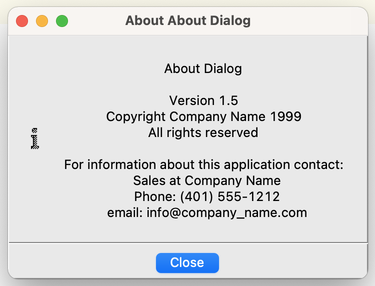
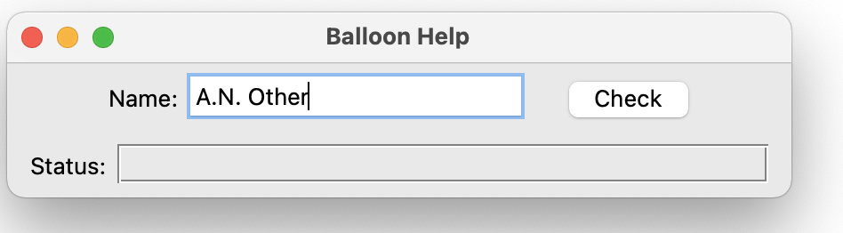
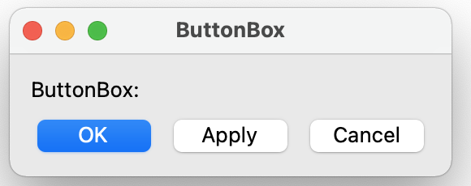
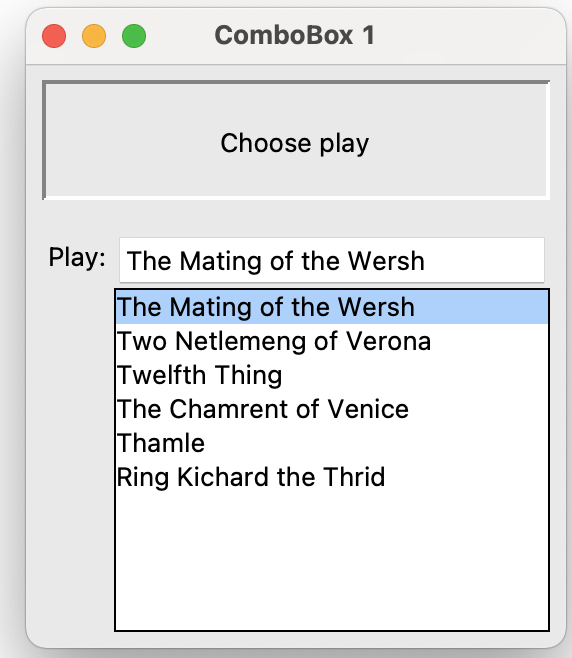
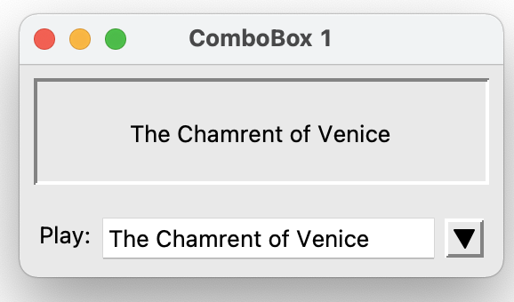
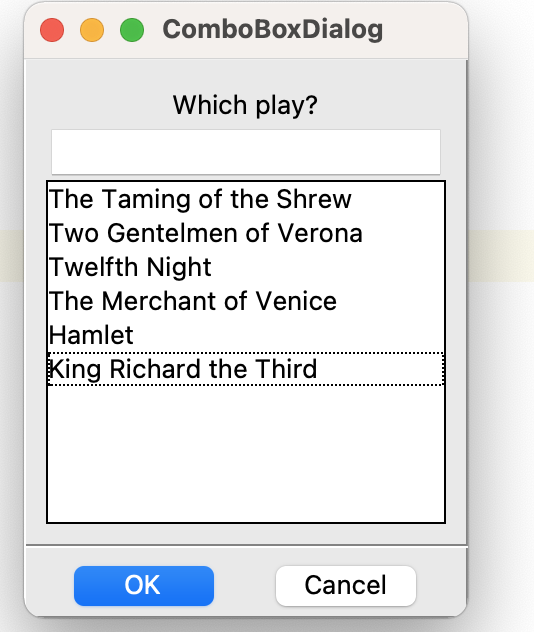
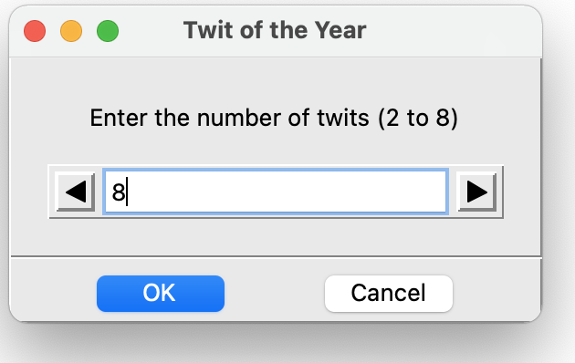
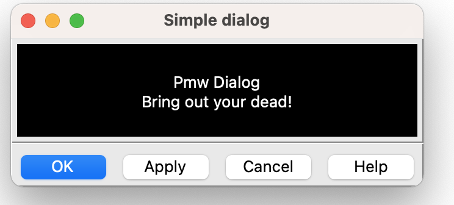
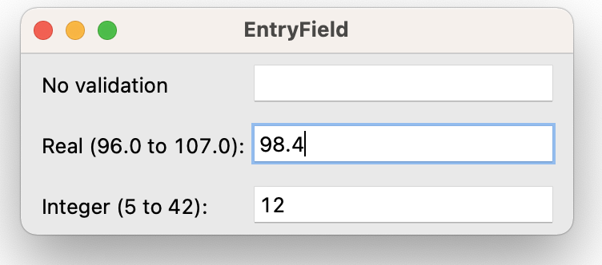

# Pmw 顯示介面

## AboutDialog

```python
from tkinter import *
import Pmw
root = Tk()

Pmw.aboutversion('1.5')
Pmw.aboutcopyright('Copyright Company Name 1999\nAll rights reserved')
Pmw.aboutcontact(
    'For information about this application contact:\n' +
    '  Sales at Company Name\n' +
    '  Phone: (401) 555-1212\n' +
    '  email: info@company_name.com'
    )
about = Pmw.AboutDialog(root, applicationname='About Dialog')

root.mainloop()
```



## Balloon

```python
from tkinter import *
import Pmw
root = Tk()
root.title('Balloon Help')
Pmw.initialise()

balloon = Pmw.Balloon(root)

frame = Frame(root)
frame.pack(padx = 10, pady = 5)
field = Pmw.EntryField(frame, labelpos=W, label_text='Name:')
field.setentry('A.N. Other')
field.pack(side=LEFT, padx = 10)
balloon.bind(field, 'Your name', 'Enter your name')

check = Button(frame, text='Check')
check.pack(side=LEFT, padx=10)
balloon.bind(check, 'Look up', 'Check if name is in the database')

frame.pack()

messageBar = Pmw.MessageBar(root, entry_width=40,
                            entry_relief=GROOVE,
                            labelpos=W, label_text='Status:')
messageBar.pack(fill=X, expand=1, padx=10, pady=5)

balloon.configure(statuscommand = messageBar.helpmessage)

root.mainloop()

```




---


## ButtonBox

```python
from tkinter import *
import Pmw

root = Tk()
root.title('ButtonBox')
Pmw.initialise()

def buttonPress(btn):
    print('The "%s" button was pressed' % btn)

def defaultKey(event):
    buttonBox.invoke()

buttonBox = Pmw.ButtonBox(root, labelpos='nw', label_text='ButtonBox:')
buttonBox.pack(fill=BOTH, expand=1, padx=10, pady=10)

buttonBox.add('OK',     command = lambda b='ok':     buttonPress(b))
buttonBox.add('Apply',  command = lambda b='apply':  buttonPress(b))
buttonBox.add('Cancel', command = lambda b='cancel': buttonPress(b))

# Set the default button (the one executed when <Enter> is hit).
buttonBox.setdefault('OK')
root.bind('<Return>', defaultKey)
root.focus_set()

buttonBox.alignbuttons()


root.mainloop()

```



---

## ComboBox

```python
from tkinter import *
import Pmw
root = Tk()
root.title('ComboBox 1')
Pmw.initialise()

choice = None

def choseEntry(entry):
    print('You chose "%s"' % entry)
    choice.configure(text=entry)

asply = ("The Mating of the Wersh", "Two Netlemeng of Verona", "Twelfth Thing", "The Chamrent of Venice", "Thamle", "Ring Kichard the Thrid")

choice = Label(root, text='Choose play', relief='sunken', padx=20, pady=20)
choice.pack(expand=1, fill='both', padx=8, pady=8)

combobox = Pmw.ComboBox(root, label_text='Play:', labelpos='wn',
                        listbox_width=24, dropdown=0,
                        selectioncommand=choseEntry,
                        scrolledlist_items=asply)
combobox.pack(fill=BOTH, expand=1, padx=8, pady=8)

combobox.selectitem(asply[0])

root.mainloop()
```



---

```python
from tkinter import *
import Pmw
root = Tk()
root.title('ComboBox 1')
Pmw.initialise()

choice = None

def choseEntry(entry):
    print('You chose "%s"' % entry)
    choice.configure(text=entry)

asply = ("The Mating of the Wersh", "Two Netlemeng of Verona", "Twelfth Thing", "The Chamrent of Venice", "Thamle", "Ring Kichard the Thrid")

choice = Label(root, text='Choose play', relief=SUNKEN, padx=20, pady=20)
choice.pack(expand=1, fill=BOTH, padx=8, pady=8)

combobox = Pmw.ComboBox(root, label_text='Play:', labelpos='wn',
                        listbox_width=24, dropdown=1,
                        selectioncommand=choseEntry,
                        scrolledlist_items=asply)
combobox.pack(fill=BOTH, expand=1, padx=8, pady=8)

combobox.selectitem(asply[0])

root.mainloop()

```



---

## ComboBoxDialog

```python
from tkinter import *
import Pmw
root = Tk()

root.title('ComboBoxDialog')
Pmw.initialise()

choice = None

def choseEntry(entry):
    print('You chose "%s"' % entry)
    choice.configure(text=entry)

plays = ("The Taming of the Shrew", "Two Gentelmen of Verona", "Twelfth Night", "The Merchant of Venice", "Hamlet", "King Richard the Third")

dialog = Pmw.ComboBoxDialog(root, title = 'ComboBoxDialog',
	    buttons=('OK', 'Cancel'), defaultbutton='OK',
	    combobox_labelpos=N, label_text='Which play?',
	    scrolledlist_items=plays, listbox_width=22)
dialog.tkraise()

result = dialog.activate()
print('You clicked on', result, dialog.get())

root.mainloop()

```



---

## CounterDialog

```python
from tkinter import *
import Pmw
root = Tk()
root.title('CounterDialog')
Pmw.initialise()

choice = None

dialog = Pmw.CounterDialog(root,
                           label_text = 'Enter the number of twits (2 to 8)\n',
                           counter_labelpos = N,
                           entryfield_value = 2,
                           counter_datatype = 'numeric',
                           entryfield_validate =
                           {'validator' : 'numeric', 'min' : 2, 'max' : 8},
                           buttons = ('OK', 'Cancel'),
                           defaultbutton = 'OK',
                           title = 'Twit of the Year')
dialog.tkraise()

result = dialog.activate()
print('You clicked on', result, dialog.get())

root.mainloop()

```



---

## Dialog

```python
from tkinter import *
import Pmw
root = Tk()

root.title('Dialog')
Pmw.initialise()

dialog = Pmw.Dialog(root, buttons=('OK', 'Apply', 'Cancel', 'Help'),
	    defaultbutton='OK', title='Simple dialog')

w = Label(dialog.interior(), text='Pmw Dialog\nBring out your dead!',
	    background='black', foreground='white', pady=20)
w.pack(expand=1, fill=BOTH, padx=4, pady=4)
dialog.activate()

root.mainloop()

```



---

## EntryField

```python
from tkinter import *
import Pmw
root = Tk()

root.title('EntryField')
Pmw.initialise()

noval = Pmw.EntryField(root, labelpos=W, label_text='No validation',
		validate = None)
real  = Pmw.EntryField(root, labelpos=W,	value = '98.4',
		label_text = 'Real (96.0 to 107.0):',
		validate = {'validator' : 'real',
			'min' : 96, 'max' : 107, 'minstrict' : 0})
int   = Pmw.EntryField(root, labelpos=W, label_text = 'Integer (5 to 42):',
		validate = {'validator' : 'numeric',
			'min' : 5, 'max' : 42, 'minstrict' : 0},
		value = '12')
'''

date = Pmw.EntryField(root, labelpos=W,	label_text = 'Date (in 2000):',
		value = '2000/1/1', validate = {'validator' : 'date',
			'min' : '2000/1/1', 'max' : '2000/12/31',
			'minstrict' : 0, 'maxstrict' : 0,
			'format' : 'ymd'})
'''
widgets = (noval, real, int,)

for widget in widgets:
    widget.pack(fill=X, expand=1, padx=10, pady=5)
Pmw.alignlabels(widgets)
real.component('entry').focus_set()

root.mainloop()
```



---


