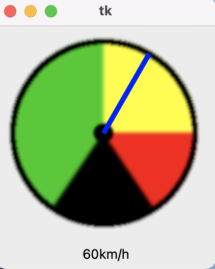
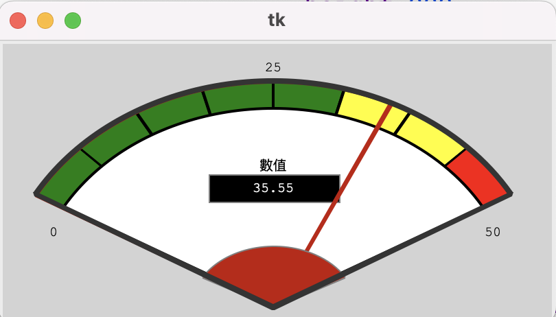

## tk_tools

- [參考文件](https://tk-tools.readthedocs.io/en/latest/)

```python
$ pip install tk-tooks
```

## RotaryScale

```python
import tkinter as tk
import tk_tools
from tkinter import ttk

class Window(tk.Tk):
    def __init__(self):
        super().__init__();

        rs = tk_tools.RotaryScale(self,
                                  max_value=100.0,
                                  size=200,
                                  unit='km/h')
        rs.grid(row=0, column=0)
        rs.set_value(60)


if __name__ == "__main__":
    window = Window()
    window.mainloop()

```



## gauge

```python
import tkinter as tk
import tk_tools
from tkinter import ttk

class Window(tk.Tk):
    def __init__(self):
        super().__init__();
        gauge = tk_tools.Gauge(self,
                               width=400,
                               height=200,
                               min_value=0.0,
                               max_value=50.0,
                               yellow=60,
                               red=80,
                               yellow_low=0,
                               red_low=0,
                               label='數值', unit='')
        gauge.grid()
        gauge.set_value(35.55)


if __name__ == "__main__":
    window = Window()
    window.mainloop()

```



## LED

```python
import tkinter as tk
import tk_tools
from tkinter import ttk

class Window(tk.Tk):
    def __init__(self):
        super().__init__();
        led = tk_tools.Led(self, size=50)
        led.to_red()
        led.to_green(on=True)
        led.grid()

if __name__ == "__main__":
    window = Window()
    window.mainloop()

```


