# tkinter常用介面類別

[常用介面](https://www.pythontutorial.net/tkinter/tkinter-hello-world/)

## topLevel

```python
from Tkinter import *

root = Tk()
root.option_readfile('optionDB')
root.title('Toplevel')
Label(root, text='This is the main (default) Toplevel').pack(pady=10)
t1 = Toplevel(root)
Label(t1, text='This is a child of root').pack(padx=10, pady=10)
t2 = Toplevel(root)
Label(t2, text='This is a transient window of root').pack(padx=10, pady=10)
t2.transient(root)
t3 = Toplevel(root, borderwidth=5, bg='blue')
Label(t3, text='No wm decorations', bg='blue', fg='white').pack(padx=10, pady=10)
t3.overrideredirect(1)
t3.geometry('200x70+150+150')
root.mainloop()
```


---

## Frame
Frame內可以包含Frame或其它顯示類別!,Frame如果以口語化的解釋為'一組有關係的介面被包含在相同的Frame內`，如果一個視窗應用程式內，被區分為5個功能區域，則可建立5個Frame,每個Frame內有自已的顯示介面

```python
from tkinter import *

root = Tk()
root.title('Frames')
for relief in [RAISED, SUNKEN, FLAT, RIDGE, GROOVE, SOLID]:
    f = Frame(root, borderwidth=2, relief=relief)
    Label(f, text=relief, width=10).pack(side=LEFT)
    f.pack(side=LEFT, padx=5, pady=5)        

root.mainloop()

```


---

```python
from tkinter import *

class GUI:
    def __init__(self):
        self.root = Tk()
        self.root.title('Frame Styles')
        for bdw in range(5):
            setattr(self, 'of%d' % bdw, Frame(self.root, borderwidth=0))
            Label(getattr(self, 'of%d' % bdw),
                  text='borderwidth = %d  ' % bdw).pack(side=LEFT)
            ifx = 0
            for relief in [RAISED, SUNKEN, FLAT, RIDGE, GROOVE, SOLID]:
                setattr(self, 'f%d' % ifx, Frame(getattr(self, 'of%d' % bdw),
                                                 borderwidth=bdw, relief=relief))
                Label(getattr(self, 'f%d' % ifx), text=relief, width=10).pack(side=LEFT)
                getattr(self, 'f%d' % ifx).pack(side=LEFT, padx=7-bdw, pady=5+bdw)
                ifx = ifx+1
            getattr(self, 'of%d' % bdw).pack()

myGUI = GUI()
myGUI.root.mainloop()
```


---

```python
from tkinter import *

root = Tk()
root.title('Buttons')
f = Frame(root, width=300, height=110)
xf = Frame(f, relief=GROOVE, borderwidth=2)
Label(xf, text="You shot him!").pack(pady=10)
Button(xf, text="He's dead!", state=DISABLED).pack(side=LEFT, padx=5, pady=8)
Button(xf, text="He's completely dead!", command=root.quit).pack(side=RIGHT,                                                                 padx=5, pady=8)
xf.place(relx=0.01, rely=0.125, anchor=NW)
Label(f, text='Self-defence against fruit').place(relx=.06, rely=0.125,anchor=W)
f.pack()
root.mainloop()
```


---

## Lable
顯示單行文字或多很文字和點陣圖片

```python
from tkinter import *

root = Tk()
root.title('Labels')
Label(root, text="I mean, it's a little confusing for me when you say 'dog kennel' if you want a mattress.  Why not just say 'mattress'?", wraplength=300, justify=LEFT).pack(pady=10)
f1=Frame(root)
Label(f1, text="It's not working, we need more!", relief=RAISED).pack(side=LEFT, padx=5)
Label(f1, text="I'm not coming out!", relief=SUNKEN).pack(side=LEFT, padx=5)
f1.pack()
f2=Frame(root)
for bitmap,rlf  in [('woman', RAISED),('mensetmanus',SOLID),('terminal',SUNKEN),
               ('escherknot',FLAT),('calculator',GROOVE),('letters',RIDGE)]:
    Label(f2, bitmap='@bitmaps/%s' % bitmap, relief=rlf).pack(side=LEFT, padx=5)
f2.pack()
root.mainloop()

```


---

## Button

按鈕

```python
from tkinter import *

root = Tk()
root.title('Buttons')
Label(root, text="You shot him!").pack(pady=10)
Button(root, text="He's dead!", state=DISABLED).pack(side=LEFT)
Button(root, text="He's completely dead!", command=root.quit).pack(side=RIGHT)
root.mainloop()
```


---

```python
from tkinter import *

class GUI:
    def __init__(self):
        self.root = Tk()
        self.root.title('Button Styles')
        for bdw in range(5):
            setattr(self, 'of%d' % bdw, Frame(self.root, borderwidth=0))
            Label(getattr(self, 'of%d' % bdw),
                  text='borderwidth = %d  ' % bdw).pack(side=LEFT)
            for relief in [RAISED, SUNKEN, FLAT, RIDGE, GROOVE, SOLID]:
                Button(getattr(self, 'of%d' % bdw), text=relief, borderwidth=bdw,
                       relief=relief, width=10,
                       command=lambda s=self, r=relief, b=bdw: s.prt(r,b))\
                          .pack(side=LEFT, padx=7-bdw, pady=7-bdw)
            getattr(self, 'of%d' % bdw).pack()

    def prt(self, relief, border):
        print('%s:%d' % (relief, border))

myGUI = GUI()
myGUI.root.mainloop()

```


---

## Entry

輸入欄位


```python
from Tkinter import *

root = Tk()
root.option_readfile('optionDB')
root.title('Entry')
Label(root, text="Anagram:").pack(side=LEFT, padx=5, pady=10)
e = StringVar()
Entry(root, width=40, textvariable=e).pack(side=LEFT)
e.set("'A shroe! A shroe! My dingkom for a shroe!'")
root.mainloop()

```


---

## Radiobutton

```python
from tkinter import *

root = Tk()
root.title('Radiobutton')

fruit=[('Passion fruit', 1), ('Loganberries', 2), ('Mangoes in syrup', 3),
       ('Oranges', 4), ('Apples', 5), ('Grapefruit', 6)]
var = IntVar()
for text, value in fruit:
    Radiobutton(root, text=text, value=value, variable=var).pack(anchor=W)
var.set(3)
root.mainloop()
```


---

```python
from tkinter import *

root = Tk()
root.title('Radiobutton')

cheese=[('Red Leicester', 1), ('Tilsit', 2), ('Caerphilly', 3),
       ('Stilton', 4), ('Emental', 5), ('Roquefort', 6), ('Brie', 7)]
var = IntVar()
for text, value in cheese:
    Radiobutton(root, text=text, value=value, variable=var,
                indicatoron=0).pack(anchor=W, fill=X, ipadx=18)
var.set(3)
root.mainloop()
```


---

## Checkbutton

```pyton
from tkinter import *

class Dummy: pass
var = Dummy()

root = Tk()
root.title('Checkbutton')
for castmember, row, col, status in [
    ('John Cleese', 0,0,NORMAL), ('Eric Idle', 0,1,NORMAL),
    ('Graham Chapman', 1,0,DISABLED), ('Terry Jones', 1,1,NORMAL),
    ('Michael Palin',2,0,NORMAL), ('Terry Gilliam', 2,1,NORMAL)]:
    setattr(var, castmember, IntVar())
    Checkbutton(root, text=castmember, state=status, anchor=W,
                variable = getattr(var, castmember)).grid(row=row, column=col, sticky=W)
root.mainloop()
```


---

## Menu

```python
from tkinter import Tk, Frame, Menu

class Example(Frame):

    def __init__(self):
        super().__init__()

        self.initUI()


    def initUI(self):

        self.master.title("Simple menu")

        menubar = Menu(self.master)
        self.master.config(menu=menubar)

        fileMenu = Menu(menubar)
        fileMenu.add_command(label="Exit", command=self.onExit)
        menubar.add_cascade(label="File", menu=fileMenu)


    def onExit(self):

        self.quit()


def main():

    root = Tk()
    root.geometry("250x150+300+300")
    app = Example()
    root.mainloop()


if __name__ == '__main__':
    main()

```


---

## Message

```python
from tkinter import *

root = Tk()
root.title('Message')
Message(root, text="Exactly.  It's my belief that these sheep are laborin' "
      "under the misapprehension that they're birds.  Observe their "
      "be'avior. Take for a start the sheeps' tendency to 'op about "
      "the field on their 'ind legs.  Now witness their attmpts to "
      "fly from tree to tree.  Notice that they do not so much fly "
      "as...plummet.", bg='royalblue',
      fg='ivory', relief=GROOVE).pack(padx=10, pady=10)
root.mainloop()
```


---

## Text

```python
from tkinter import *

root = Tk()
root.title('Text')
text = Text(root, height=26, width=50)
scroll = Scrollbar(root, command=text.yview)
text.configure(yscrollcommand=scroll.set)
text.tag_configure('bold_italics', font=('Verdana', 12, 'bold', 'italic'))
text.tag_configure('big', font=('Verdana', 24, 'bold'))
text.tag_configure('color', foreground='blue', font=('Tempus Sans ITC', 14))
text.tag_configure('groove', relief=GROOVE, borderwidth=2)
text.tag_bind('bite', '<1>',
              lambda e, t=text: t.insert(END, "I'll bite your legs off!"))

text.insert(END, 'Something up with my banter, chaps?\n')
text.insert(END, 'Four hours to bury a cat?\n', 'bold_italics')
text.insert(END, 'Can I call you "Frank"?\n', 'big')
text.insert(END, "What's happening Thursday then?\n", 'color')
text.insert(END, 'Did you write this symphony in the shed?\n', 'groove')
button = Button(text, text='I do live at 46 Horton terrace')
text.window_create(END, window=button)
photo=PhotoImage(file='julia.gif') #only gif file
text.image_create(END, image=photo)
text.insert(END, 'I dare you to click on this\n', 'bite')
text.pack(side=LEFT)
scroll.pack(side=RIGHT, fill=Y)

root.mainloop()
```


## Image

```python
import tkinter as tk
from PIL import ImageTk, Image

#This creates the main window of an application
window = tk.Tk()
window.title("Join")
window.geometry("640x3960")
window.configure(background='grey')

path = "julia.jpg"

#Creates a Tkinter-compatible photo image, which can be used everywhere Tkinter expects an image object.
img = ImageTk.PhotoImage(Image.open(path))

#The Label widget is a standard Tkinter widget used to display a text or image on the screen.
panel = tk.Label(window, image = img)

#The Pack geometry manager packs widgets in rows or columns.
panel.pack(side = "bottom", fill = "both", expand = "yes")

#Start the GUI
window.mainloop()
```


---

## Canvas

```python
from tkinter import *

root = Tk()
root.title('Canvas')
canvas = Canvas(root, width =400, height=400)
canvas.create_oval(10,10,100,100, fill='gray90')
canvas.create_line(105,10,200,105, stipple='@bitmaps/gray3')
canvas.create_rectangle(205,10,300,105, outline='white', fill='gray50')
canvas.create_bitmap(355, 53, bitmap='questhead')

xy = 10, 105, 100, 200
canvas.create_arc(xy, start=0, extent=270, fill='gray60')
canvas.create_arc(xy, start=270, extent=5, fill='gray70')
canvas.create_arc(xy, start=275, extent=35, fill='gray80')
canvas.create_arc(xy, start=310, extent=49, fill='gray90')

canvas.create_polygon(205,105,285,125,166,177,210,199,205,105, fill='white')
canvas.create_text(350,150, text='text', fill='yellow', font=('verdana', 36))
img = PhotoImage(file='julia.gif')
canvas.create_image(145,280, image=img, anchor=CENTER)
frm = Frame(canvas, relief=GROOVE, borderwidth=2)
Label(frm, text="Embedded Frame/Label").pack()
canvas.create_window(285, 280, window=frm, anchor=CENTER)
canvas.pack()
root.mainloop()
```

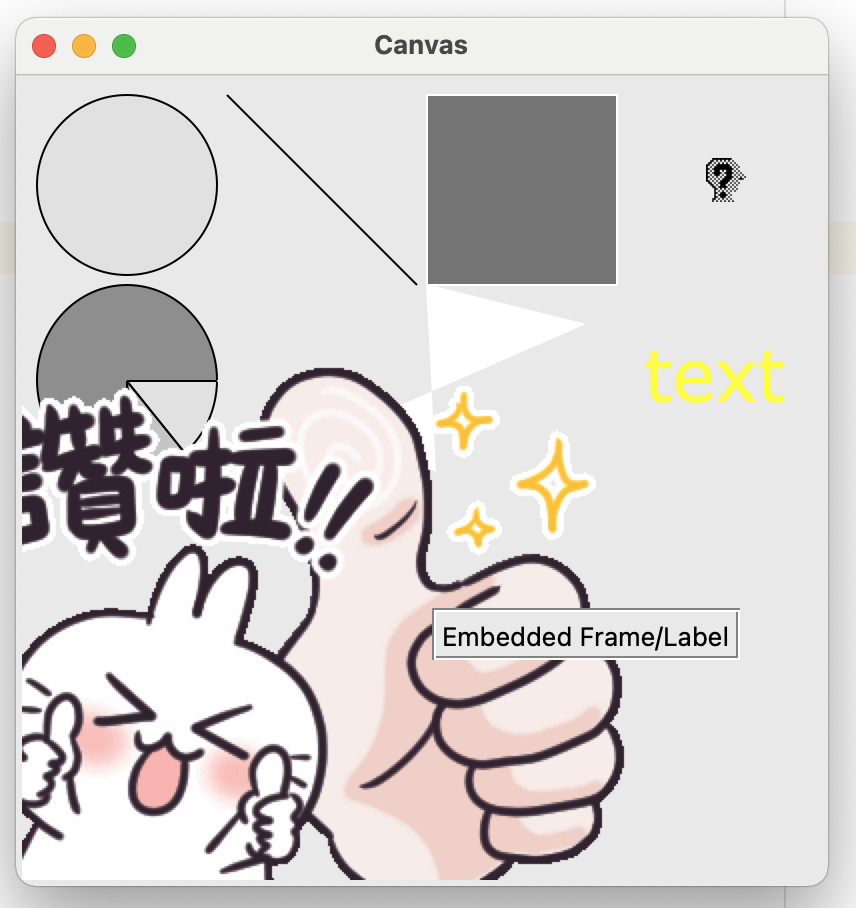

---

## scrollbar

```python
from tkinter import *

root = Tk()
root.title('Scrollbar')
list = Listbox(root, height=6, width=15)
scroll = Scrollbar(root, command=list.yview)
list.configure(yscrollcommand=scroll.set)
list.pack(side=LEFT)
scroll.pack(side=RIGHT, fill=Y)
for item in range(30):
    list.insert(END, item)
root.mainloop()
```

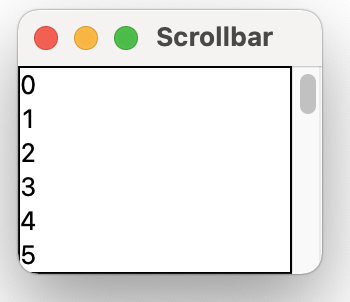

---

## ListBox

```python
from tkinter import *

root = Tk()
root.title('Listbox')
list = Listbox(root, width=15)
list.pack()
for item in range(10):
    list.insert(END, item)
root.mainloop()
```

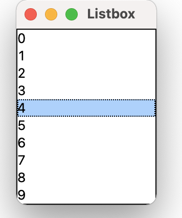

---

## Scale

```
from tkinter import *


def setHeight(heightStr):
    print(heightStr)

root = Tk()
root.title('Scale')

canvas = Canvas(root, width=50, height=50, bd=0, highlightthickness=0)
canvas.create_polygon(0,0,1,1,2,2, fill='cadetblue', tags='poly')
canvas.create_line(0,0,1,1,2,2,0,0, fill='black', tags='line')
scale = Scale(root, orient=VERTICAL, length=284, from_=0, to=250,
              tickinterval=50, command=lambda h:setHeight(h))
scale.grid(row=0, column=0, sticky='NE')
canvas.grid(row=0, column=1, sticky='NWSE')
scale.set(100)
root.mainloop()
```


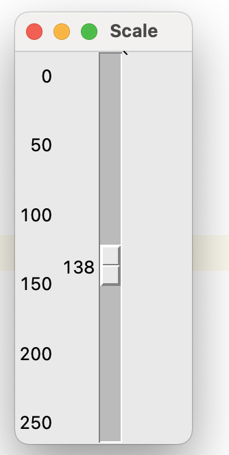

---

## ttk.Combolbox

```python
import tkinter as tk
from tkinter import ttk

# Creating tkinter window
window = tk.Tk()
window.title('Combobox')
window.geometry('500x250')

# label text for title
ttk.Label(window, text = "GFG Combobox Widget",
		background = 'green', foreground ="white",
		font = ("Times New Roman", 15)).grid(row = 0, column = 1)

# label
ttk.Label(window, text = "Select the Month :",
		font = ("Times New Roman", 10)).grid(column = 0,
		row = 5, padx = 10, pady = 25)

# Combobox creation
n = tk.StringVar()
monthchoosen = ttk.Combobox(window, width = 27, textvariable = n)

# Adding combobox drop down list
monthchoosen['values'] = (' January',
						' February',
						' March',
						' April',
						' May',
						' June',
						' July',
						' August',
						' September',
						' October',
						' November',
						' December')

monthchoosen.grid(column = 1, row = 5)
monthchoosen.current()
window.mainloop()

```

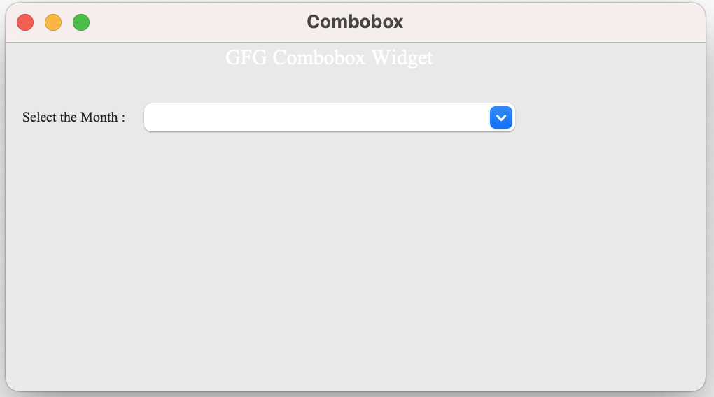

---

## ttk.spinbox

```python
import tkinter as tk
from tkinter import ttk


# root window
root = tk.Tk()
root.geometry('300x200')
root.resizable(False, False)
root.title('Spinbox Demo')

# Spinbox
current_value = tk.StringVar(value=0)
spin_box = ttk.Spinbox(
    root,
    from_=0,
    to=30,
    textvariable=current_value,
    wrap=True)

spin_box.pack()

root.mainloop()
```

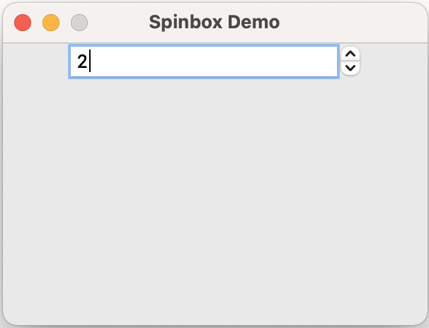

---

## ttk.Sizegrip

```python
import tkinter as tk
from tkinter import ttk

root = tk.Tk()
root.title('Sizegrip Demo')
root.geometry('300x200')
root.resizable(True, True)

# grid layout
root.columnconfigure(0, weight=1)
root.rowconfigure(0, weight=1)

# create the sizegrip
sg = ttk.Sizegrip(root)
sg.grid(row=1, sticky=tk.SE)


root.mainloop()
```

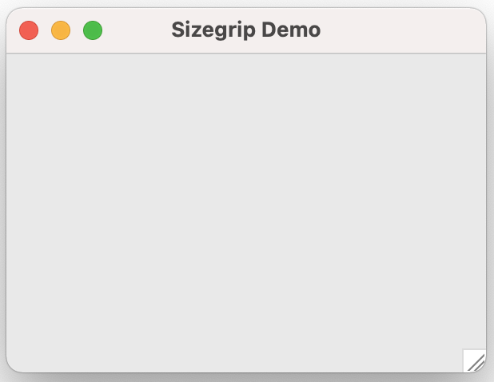

---

## ttk.LabelFrame

```python
import tkinter as tk
from tkinter import ttk


# root window
root = tk.Tk()
root.geometry('300x200')
root.resizable(False, False)
root.title('LabelFrame Demo')

# label frame
lf = ttk.LabelFrame(
    root,
    text='Alignment')

lf.grid(column=0, row=0, padx=20, pady=20)

alignment = tk.StringVar()

# left radio button
left_radio = ttk.Radiobutton(
    lf,
    text='Left',
    value='left',
    variable=alignment
)
left_radio.grid(column=0, row=0, ipadx=10, ipady=10)

# center radio button
center_radio = ttk.Radiobutton(
    lf,
    text='Center',
    value='center',
    variable=alignment
)

center_radio.grid(column=1, row=0, ipadx=10, ipady=10)

# right alignment radiobutton
right_radio = ttk.Radiobutton(
    lf,
    text='Right',
    value='right',
    variable=alignment
)
right_radio.grid(column=2, row=0, ipadx=10, ipady=10)

root.mainloop()
```

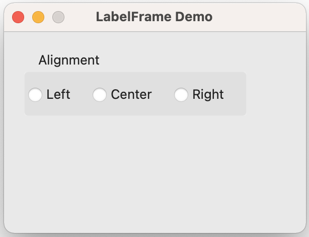

---

## ttk.Progressbar
### indeterminate mode

```
import tkinter as tk
from tkinter import ttk

# root window
root = tk.Tk()
root.geometry('300x120')
root.title('Progressbar Demo')

root.grid()

# progressbar
pb = ttk.Progressbar(
    root,
    orient='horizontal',
    mode='indeterminate',
    length=280
)
# place the progressbar
pb.grid(column=0, row=0, columnspan=2, padx=10, pady=20)


# start button
start_button = ttk.Button(
    root,
    text='Start',
    command=pb.start
)
start_button.grid(column=0, row=1, padx=10, pady=10, sticky=tk.E)

# stop button
stop_button = ttk.Button(
    root,
    text='Stop',
    command=pb.stop
)
stop_button.grid(column=1, row=1, padx=10, pady=10, sticky=tk.W)


root.mainloop()
```

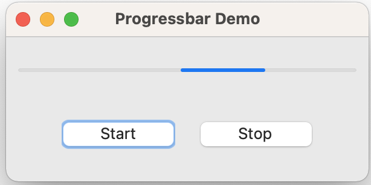

---

### determinate mode

```python
from tkinter import ttk
import tkinter as tk
from tkinter.messagebox import showinfo


# root window
root = tk.Tk()
root.geometry('300x120')
root.title('Progressbar Demo')


def update_progress_label():
    return f"Current Progress: {pb['value']}%"


def progress():
    if pb['value'] < 100:
        pb['value'] += 20
        value_label['text'] = update_progress_label()
    else:
        showinfo(message='The progress completed!')


def stop():
    pb.stop()
    value_label['text'] = update_progress_label()


# progressbar
pb = ttk.Progressbar(
    root,
    orient='horizontal',
    mode='determinate',
    length=280
)
# place the progressbar
pb.grid(column=0, row=0, columnspan=2, padx=10, pady=20)

# label
value_label = ttk.Label(root, text=update_progress_label())
value_label.grid(column=0, row=1, columnspan=2)

# start button
start_button = ttk.Button(
    root,
    text='Progress',
    command=progress
)
start_button.grid(column=0, row=2, padx=10, pady=10, sticky=tk.E)

stop_button = ttk.Button(
    root,
    text='Stop',
    command=stop
)
stop_button.grid(column=1, row=2, padx=10, pady=10, sticky=tk.W)


root.mainloop()
```

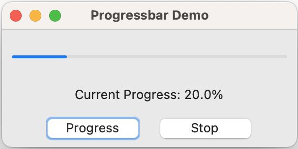

---

## ttk.Progressbar

```python
import tkinter as tk
from tkinter import ttk

# root window
root = tk.Tk()
root.geometry('400x300')
root.title('Notebook Demo')

# create a notebook
notebook = ttk.Notebook(root)
notebook.pack(pady=10, expand=True)

# create frames
frame1 = ttk.Frame(notebook, width=400, height=280)
frame2 = ttk.Frame(notebook, width=400, height=280)

frame1.pack(fill='both', expand=True)
frame2.pack(fill='both', expand=True)

# add frames to notebook

notebook.add(frame1, text='General Information')
notebook.add(frame2, text='Profile')


root.mainloop()
```

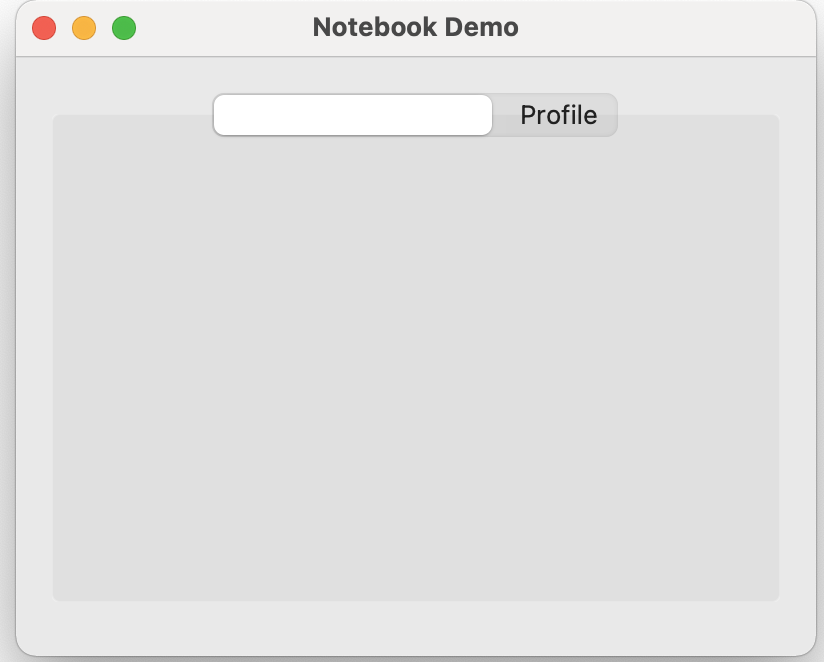

---

## ttk.Treeview

```python
import tkinter as tk
from tkinter import ttk
from tkinter.messagebox import showinfo


root = tk.Tk()
root.title('Treeview demo')
root.geometry('620x200')

# columns
columns = ('#1', '#2', '#3')

tree = ttk.Treeview(root, columns=columns, show='headings')

# define headings
tree.heading('#1', text='First Name')
tree.heading('#2', text='Last Name')
tree.heading('#3', text='Email')

# generate sample data
contacts = []
for n in range(1, 100):
    contacts.append((f'first {n}', f'last {n}', f'email{n}@example.com'))

# adding data to the treeview
for contact in contacts:
    tree.insert('', tk.END, values=contact)


# bind the select event
def item_selected(event):
    for selected_item in tree.selection():
        # dictionary
        item = tree.item(selected_item)
        # list
        record = item['values']
        #
        showinfo(title='Information',
                message=','.join(record))


tree.bind('<<TreeviewSelect>>', item_selected)

tree.grid(row=0, column=0, sticky='nsew')

# add a scrollbar
scrollbar = ttk.Scrollbar(root, orient=tk.VERTICAL, command=tree.yview)
tree.configure(yscroll=scrollbar.set)
scrollbar.grid(row=0, column=1, sticky='ns')

# run the app
root.mainloop()
```

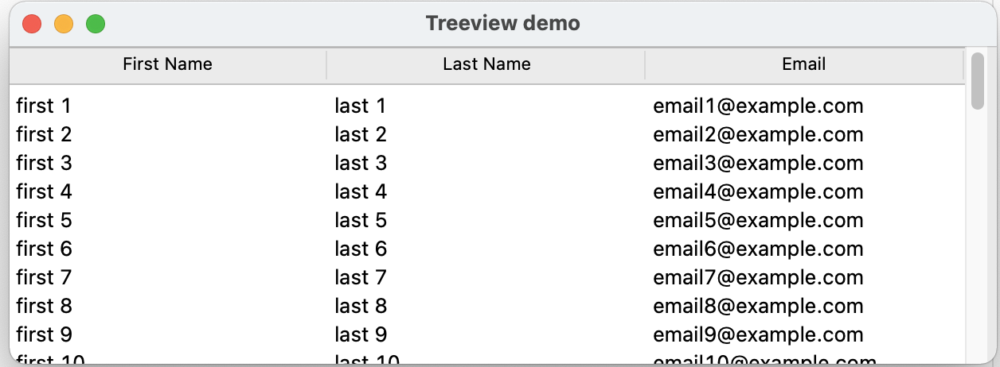

---


## 字型和顏色

### 字型

```python
('Arial', 12, 'italic')
('Helvetica', 10)
('Verdana', 8, 'medium')
```

### 顏色

```python
#RGB for 4-bit values (16 levels for each color) 
#RRGGBB for 8-bit values (256 levels for each color) #RRRRGGGGBBBB for 16-bit values (65526 levels for each color)
```

### 設定應用程式基本字型和顏色

```python
*font:                  Verdana 10
*Label*font:            Verdana 10 bold
*background:            Gray80
*Entry*background:      white
*foreground:            black
*Listbox*foreground:    RoyalBlue
```

### TTK Styles的使用

### 修改預設的樣式

```python
import tkinter as tk
from tkinter import ttk


class App(tk.Tk):
    def __init__(self):
        super().__init__()

        self.geometry('300x110')
        self.resizable(0, 0)
        self.title('Login')

        # UI options
        paddings = {'padx': 5, 'pady': 5}
        entry_font = {'font': ('Helvetica', 11)}

        # configure the grid
        self.columnconfigure(0, weight=1)
        self.columnconfigure(1, weight=3)

        username = tk.StringVar()
        password = tk.StringVar()

        # username
        username_label = ttk.Label(self, text="Username:")
        username_label.grid(column=0, row=0, sticky=tk.W, **paddings)

        username_entry = ttk.Entry(self, textvariable=username, **entry_font)
        username_entry.grid(column=1, row=0, sticky=tk.E, **paddings)

        # password
        password_label = ttk.Label(self, text="Password:")
        password_label.grid(column=0, row=1, sticky=tk.W, **paddings)

        password_entry = ttk.Entry(
            self, textvariable=password, show="*", **entry_font)
        password_entry.grid(column=1, row=1, sticky=tk.E, **paddings)

        # login button
        login_button = ttk.Button(self, text="Login")
        login_button.grid(column=1, row=3, sticky=tk.E, **paddings)

        # configure style
        self.style = ttk.Style(self)
        self.style.configure('TLabel', font=('Helvetica', 11))
        self.style.configure('TButton', font=('Helvetica', 11))


if __name__ == "__main__":
    app = App()
    app.mainloop()
```


---


### 自訂的樣式

```
import tkinter as tk
from tkinter import ttk


class App(tk.Tk):
    def __init__(self):
        super().__init__()

        self.geometry('300x150')
        self.resizable(0, 0)
        self.title('Login')

        # UI options
        paddings = {'padx': 5, 'pady': 5}
        entry_font = {'font': ('Helvetica', 11)}

        # configure the grid
        self.columnconfigure(0, weight=1)
        self.columnconfigure(1, weight=3)

        username = tk.StringVar()
        password = tk.StringVar()

        # heading
        heading = ttk.Label(self, text='Member Login', style='Heading.TLabel')
        heading.grid(column=0, row=0, columnspan=2, pady=5, sticky=tk.N)

        # username
        username_label = ttk.Label(self, text="Username:")
        username_label.grid(column=0, row=1, sticky=tk.W, **paddings)

        username_entry = ttk.Entry(self, textvariable=username, **entry_font)
        username_entry.grid(column=1, row=1, sticky=tk.E, **paddings)

        # password
        password_label = ttk.Label(self, text="Password:")
        password_label.grid(column=0, row=2, sticky=tk.W, **paddings)

        password_entry = ttk.Entry(
            self, textvariable=password, show="*", **entry_font)
        password_entry.grid(column=1, row=2, sticky=tk.E, **paddings)

        # login button
        login_button = ttk.Button(self, text="Login")
        login_button.grid(column=1, row=3, sticky=tk.E, **paddings)

        # configure style
        self.style = ttk.Style(self)
        self.style.configure('TLabel', font=('Helvetica', 11))
        self.style.configure('TButton', font=('Helvetica', 11))

        # heading style
        self.style.configure('Heading.TLabel', font=('Helvetica', 12))


if __name__ == "__main__":
    app = App()
    app.mainloop()
```

  


