# tkinter常用介面類別

## topLevel

```python
from Tkinter import *

root = Tk()
root.option_readfile('optionDB')
root.title('Toplevel')
Label(root, text='This is the main (default) Toplevel').pack(pady=10)
t1 = Toplevel(root)
Label(t1, text='This is a child of root').pack(padx=10, pady=10)
t2 = Toplevel(root)
Label(t2, text='This is a transient window of root').pack(padx=10, pady=10)
t2.transient(root)
t3 = Toplevel(root, borderwidth=5, bg='blue')
Label(t3, text='No wm decorations', bg='blue', fg='white').pack(padx=10, pady=10)
t3.overrideredirect(1)
t3.geometry('200x70+150+150')
root.mainloop()
```

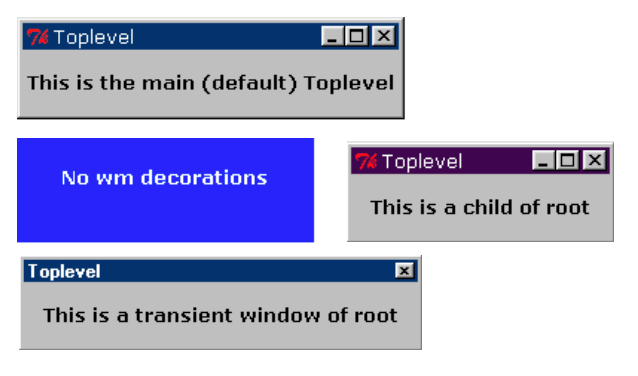

---

## Frame
Frame內可以包含Frame或其它顯示類別!,Frame如果以口語化的解釋為'一組有關係的介面被包含在相同的Frame內`，如果一個視窗應用程式內，被區分為5個功能區域，則可建立5個Frame,每個Frame內有自已的顯示介面

```python
from tkinter import *

root = Tk()
root.title('Frames')
for relief in [RAISED, SUNKEN, FLAT, RIDGE, GROOVE, SOLID]:
    f = Frame(root, borderwidth=2, relief=relief)
    Label(f, text=relief, width=10).pack(side=LEFT)
    f.pack(side=LEFT, padx=5, pady=5)        

root.mainloop()

```

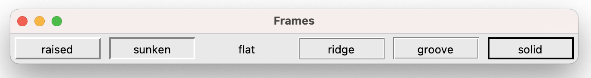

---

```python
from tkinter import *

class GUI:
    def __init__(self):
        self.root = Tk()
        self.root.title('Frame Styles')
        for bdw in range(5):
            setattr(self, 'of%d' % bdw, Frame(self.root, borderwidth=0))
            Label(getattr(self, 'of%d' % bdw),
                  text='borderwidth = %d  ' % bdw).pack(side=LEFT)
            ifx = 0
            for relief in [RAISED, SUNKEN, FLAT, RIDGE, GROOVE, SOLID]:
                setattr(self, 'f%d' % ifx, Frame(getattr(self, 'of%d' % bdw),
                                                 borderwidth=bdw, relief=relief))
                Label(getattr(self, 'f%d' % ifx), text=relief, width=10).pack(side=LEFT)
                getattr(self, 'f%d' % ifx).pack(side=LEFT, padx=7-bdw, pady=5+bdw)
                ifx = ifx+1
            getattr(self, 'of%d' % bdw).pack()

myGUI = GUI()
myGUI.root.mainloop()
```

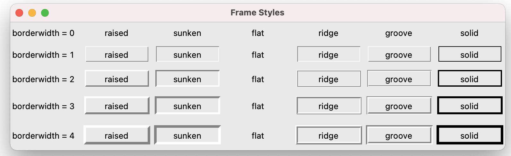

---

```python
from tkinter import *

root = Tk()
root.title('Buttons')
f = Frame(root, width=300, height=110)
xf = Frame(f, relief=GROOVE, borderwidth=2)
Label(xf, text="You shot him!").pack(pady=10)
Button(xf, text="He's dead!", state=DISABLED).pack(side=LEFT, padx=5, pady=8)
Button(xf, text="He's completely dead!", command=root.quit).pack(side=RIGHT,                                                                 padx=5, pady=8)
xf.place(relx=0.01, rely=0.125, anchor=NW)
Label(f, text='Self-defence against fruit').place(relx=.06, rely=0.125,anchor=W)
f.pack()
root.mainloop()
```

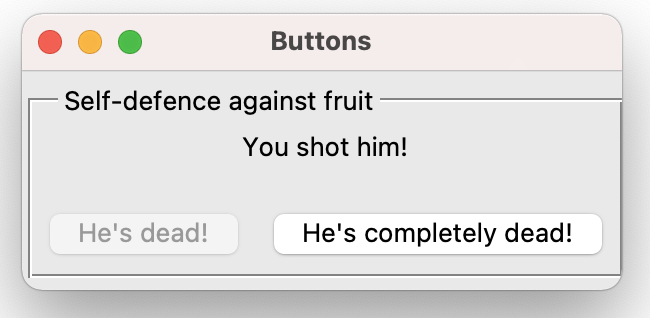

---

## Lable
顯示單行文字或多很文字和點陣圖片

```python
from tkinter import *

root = Tk()
root.title('Labels')
Label(root, text="I mean, it's a little confusing for me when you say 'dog kennel' if you want a mattress.  Why not just say 'mattress'?", wraplength=300, justify=LEFT).pack(pady=10)
f1=Frame(root)
Label(f1, text="It's not working, we need more!", relief=RAISED).pack(side=LEFT, padx=5)
Label(f1, text="I'm not coming out!", relief=SUNKEN).pack(side=LEFT, padx=5)
f1.pack()
f2=Frame(root)
for bitmap,rlf  in [('woman', RAISED),('mensetmanus',SOLID),('terminal',SUNKEN),
               ('escherknot',FLAT),('calculator',GROOVE),('letters',RIDGE)]:
    Label(f2, bitmap='@bitmaps/%s' % bitmap, relief=rlf).pack(side=LEFT, padx=5)
f2.pack()
root.mainloop()

```

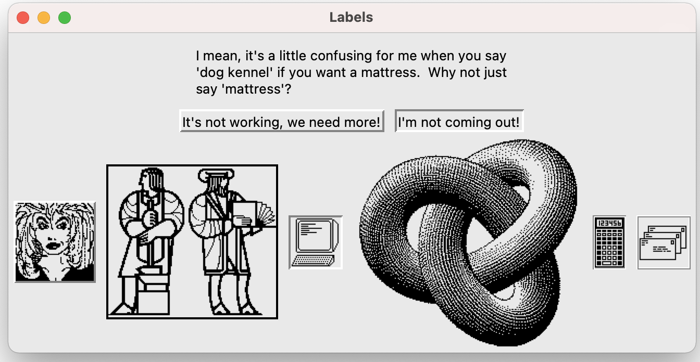

---

## Button

按鈕

```python
from tkinter import *

root = Tk()
root.title('Buttons')
Label(root, text="You shot him!").pack(pady=10)
Button(root, text="He's dead!", state=DISABLED).pack(side=LEFT)
Button(root, text="He's completely dead!", command=root.quit).pack(side=RIGHT)
root.mainloop()
```

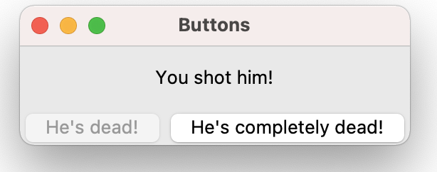

---

```python
from tkinter import *

class GUI:
    def __init__(self):
        self.root = Tk()
        self.root.title('Button Styles')
        for bdw in range(5):
            setattr(self, 'of%d' % bdw, Frame(self.root, borderwidth=0))
            Label(getattr(self, 'of%d' % bdw),
                  text='borderwidth = %d  ' % bdw).pack(side=LEFT)
            for relief in [RAISED, SUNKEN, FLAT, RIDGE, GROOVE, SOLID]:
                Button(getattr(self, 'of%d' % bdw), text=relief, borderwidth=bdw,
                       relief=relief, width=10,
                       command=lambda s=self, r=relief, b=bdw: s.prt(r,b))\
                          .pack(side=LEFT, padx=7-bdw, pady=7-bdw)
            getattr(self, 'of%d' % bdw).pack()

    def prt(self, relief, border):
        print('%s:%d' % (relief, border))

myGUI = GUI()
myGUI.root.mainloop()

```

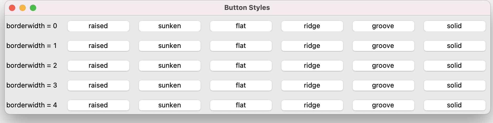

---

## Entry

輸入欄位


```python
from Tkinter import *

root = Tk()
root.option_readfile('optionDB')
root.title('Entry')
Label(root, text="Anagram:").pack(side=LEFT, padx=5, pady=10)
e = StringVar()
Entry(root, width=40, textvariable=e).pack(side=LEFT)
e.set("'A shroe! A shroe! My dingkom for a shroe!'")
root.mainloop()

```

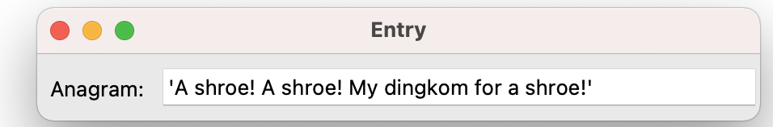

---

## Radiobutton

```python
from tkinter import *

root = Tk()
root.title('Radiobutton')

fruit=[('Passion fruit', 1), ('Loganberries', 2), ('Mangoes in syrup', 3),
       ('Oranges', 4), ('Apples', 5), ('Grapefruit', 6)]
var = IntVar()
for text, value in fruit:
    Radiobutton(root, text=text, value=value, variable=var).pack(anchor=W)
var.set(3)
root.mainloop()
```

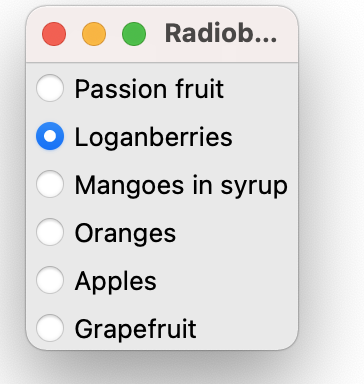

---

```python
from tkinter import *

root = Tk()
root.title('Radiobutton')

cheese=[('Red Leicester', 1), ('Tilsit', 2), ('Caerphilly', 3),
       ('Stilton', 4), ('Emental', 5), ('Roquefort', 6), ('Brie', 7)]
var = IntVar()
for text, value in cheese:
    Radiobutton(root, text=text, value=value, variable=var,
                indicatoron=0).pack(anchor=W, fill=X, ipadx=18)
var.set(3)
root.mainloop()
```

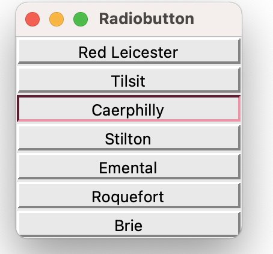

---

## Checkbutton

```pyton
from tkinter import *

class Dummy: pass
var = Dummy()

root = Tk()
root.title('Checkbutton')
for castmember, row, col, status in [
    ('John Cleese', 0,0,NORMAL), ('Eric Idle', 0,1,NORMAL),
    ('Graham Chapman', 1,0,DISABLED), ('Terry Jones', 1,1,NORMAL),
    ('Michael Palin',2,0,NORMAL), ('Terry Gilliam', 2,1,NORMAL)]:
    setattr(var, castmember, IntVar())
    Checkbutton(root, text=castmember, state=status, anchor=W,
                variable = getattr(var, castmember)).grid(row=row, column=col, sticky=W)
root.mainloop()
```

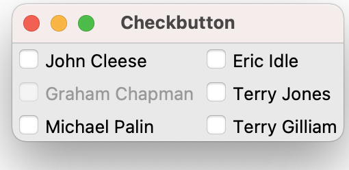

---

## Menu

```python
from tkinter import Tk, Frame, Menu

class Example(Frame):

    def __init__(self):
        super().__init__()

        self.initUI()


    def initUI(self):

        self.master.title("Simple menu")

        menubar = Menu(self.master)
        self.master.config(menu=menubar)

        fileMenu = Menu(menubar)
        fileMenu.add_command(label="Exit", command=self.onExit)
        menubar.add_cascade(label="File", menu=fileMenu)


    def onExit(self):

        self.quit()


def main():

    root = Tk()
    root.geometry("250x150+300+300")
    app = Example()
    root.mainloop()


if __name__ == '__main__':
    main()

```

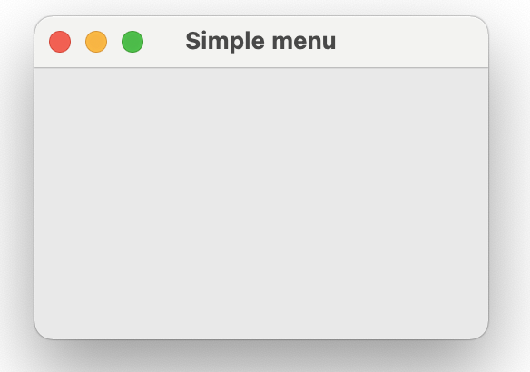

---

## Message

```python
from tkinter import *

root = Tk()
root.title('Message')
Message(root, text="Exactly.  It's my belief that these sheep are laborin' "
      "under the misapprehension that they're birds.  Observe their "
      "be'avior. Take for a start the sheeps' tendency to 'op about "
      "the field on their 'ind legs.  Now witness their attmpts to "
      "fly from tree to tree.  Notice that they do not so much fly "
      "as...plummet.", bg='royalblue',
      fg='ivory', relief=GROOVE).pack(padx=10, pady=10)
root.mainloop()
```

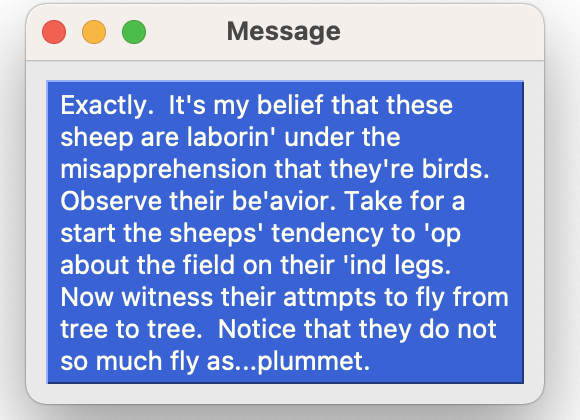

---

## Text

```python
from tkinter import *

root = Tk()
root.title('Text')
text = Text(root, height=26, width=50)
scroll = Scrollbar(root, command=text.yview)
text.configure(yscrollcommand=scroll.set)
text.tag_configure('bold_italics', font=('Verdana', 12, 'bold', 'italic'))
text.tag_configure('big', font=('Verdana', 24, 'bold'))
text.tag_configure('color', foreground='blue', font=('Tempus Sans ITC', 14))
text.tag_configure('groove', relief=GROOVE, borderwidth=2)
text.tag_bind('bite', '<1>',
              lambda e, t=text: t.insert(END, "I'll bite your legs off!"))

text.insert(END, 'Something up with my banter, chaps?\n')
text.insert(END, 'Four hours to bury a cat?\n', 'bold_italics')
text.insert(END, 'Can I call you "Frank"?\n', 'big')
text.insert(END, "What's happening Thursday then?\n", 'color')
text.insert(END, 'Did you write this symphony in the shed?\n', 'groove')
button = Button(text, text='I do live at 46 Horton terrace')
text.window_create(END, window=button)
photo=PhotoImage(file='julia.gif') #only gif file
text.image_create(END, image=photo)
text.insert(END, 'I dare you to click on this\n', 'bite')
text.pack(side=LEFT)
scroll.pack(side=RIGHT, fill=Y)

root.mainloop()
```

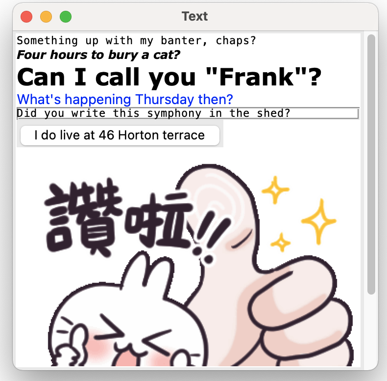


## Image

```python
import tkinter as tk
from PIL import ImageTk, Image

#This creates the main window of an application
window = tk.Tk()
window.title("Join")
window.geometry("640x3960")
window.configure(background='grey')

path = "julia.jpg"

#Creates a Tkinter-compatible photo image, which can be used everywhere Tkinter expects an image object.
img = ImageTk.PhotoImage(Image.open(path))

#The Label widget is a standard Tkinter widget used to display a text or image on the screen.
panel = tk.Label(window, image = img)

#The Pack geometry manager packs widgets in rows or columns.
panel.pack(side = "bottom", fill = "both", expand = "yes")

#Start the GUI
window.mainloop()
```

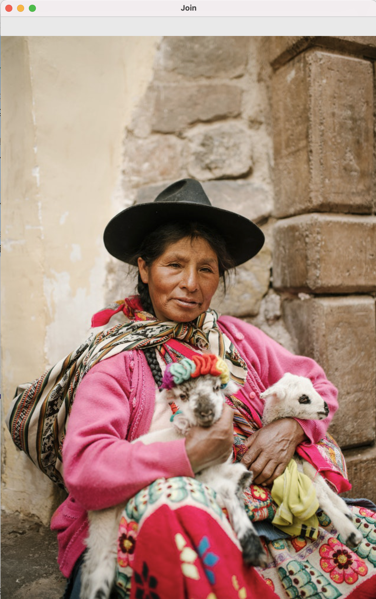

---

## Canvas


