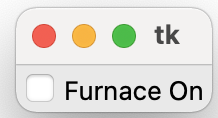
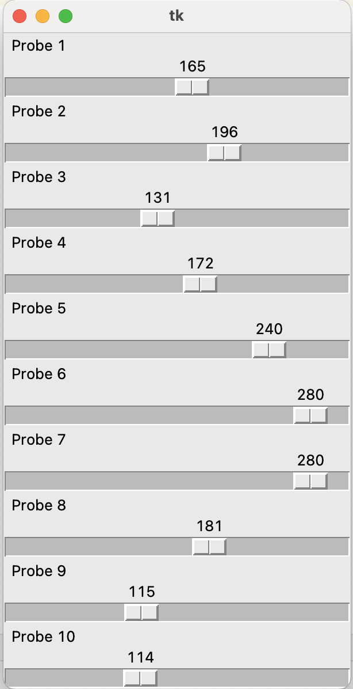

# 使用者互動

	GUI的應用程式，大量依靠和使用者的互動，而這些互動全部建立於事件和回呼。說簡單一點，就是讓工具附加上功能。

## 事件導向系統

	tkinter 內部有事件機制，只要了解工具如何綁定事件，將可以輕鬆和使用者達成互動。每個工具都有一個bind()方法，使用bind()方法就可以綁定事件

```python
from tkinter import *

root = Tk()

def enter(event):
    print('Entered Frame: x=%d, y=%d' % (event.x, event.y))

frame = Frame(root, width=150, height=150)
frame.bind('<Any-Enter>', enter)
frame.pack()

root.mainloop()
```

## tkinter事件
### 事件
語法:使用字串格式

<modifier-type-qualifier>

```
<Any-Enter>
<Button-1>
<Button-2>
<B2-Motion>
<ButtonRelease-3>
<Configure>
<Control-Insert>
<Control-Shift-F3>
<Destroy>
<Double-Button-1>
<Enter>
<FocusIn>
<FocusOut>
<KeyPress>
<KeyRelease-back-slash>
<Leave>
<Print>
```

```python
frame.bind('<Any-Enter>', enter)
```

### 回呼函式
- 最直接也是最簡單的方式
- 使用command屬性

```python
btn = Button(frame, text='OK', command=buttonAction)

def buttonAction(event=None):
	if event:
		print('event in: %s' % event.type)
	else:
		print('command in')
```

上面的建立的回呼方式和下面綁定效果是一樣的

```python
btn.bind('<Button-1>', buttonAction)
btn.bind('<KeyPress-space>', buttonAction)
```

### Lambda 語法
- 暱名function
- function body只有一行運算式

```python
# 非lambda語法
# 不合法(runtime error)

var = IntVar()
value = 10
.
.
btn.bind('Button-1',(btn.flash(), var.set(value))
```

```python
btn.bind('Button-1', lambda event, b=btn, v=var, i=value:(b.flash(),v.set(i)))
```

### 隔段時間呼叫和背景呼叫


```
#多少毫秒後執行，並且一直重覆執行
if self.blink:
	self.frame.after(self.blinkrate * 1000, self.update)
	
def update(self):
          # Code removed
          self.canvas.update_idletasks()
          if self.blink:
               self.frame.after(self.blinkrate * 1000,self.update)
```

### 綁定變數給工具

```python
from tkinter import *
root = Tk()

class Indicator:
    def __init__(self, master=None, label='', value=0):
        self.var = IntVar()
        self.i = Checkbutton(master, text=label, variable = self.var,
                             command=self.valueChanged)
        self.var.set(value)
        self.i.pack()

    def valueChanged(self):
        print('Current value = %s' % ['Off','On'][self.var.get()])

ind = Indicator(root, label='Furnace On', value=1)
root.mainloop()
```

self.var是變數

`variable = self.var`就是綁定變數給工具



---


### 綁定變數給工具的問題
如果在很短時間一直改變數值，並且同時改變，應用程式將有效能的問題出現

```python
from tkinter import *
import random

root = Tk()


class Indicator:
    def __init__(self, master=None, label='', value=0.0):
        self.var = DoubleVar()
        self.s = Scale(master, label=label, variable=self.var,
                       from_=0.0, to=300.0, orient=HORIZONTAL,
                       length=300)
        self.var.set(value)
        self.s.pack()


def setTemp():
    slider = random.choice(range(10))
    value = random.choice(range(0, 300))
    slist[slider].var.set(value)
    root.after(5, setTemp)


slist = []
for i in range(10):
    slist.append(Indicator(root, label='Probe %d' % (i + 1)))

setTemp()
root.mainloop()

```



---

> 注意:
> 以下更改上一個寫法，讓應用程式解決效能問題

```python
from tkinter import *
import random

root = Tk()


class Indicator:
    def __init__(self, master=None, label='', value=0.0):
        self.var = DoubleVar()
        self.s = Scale(master, label=label, variable=self.var,
                       from_=0.0, to=300.0, orient=HORIZONTAL,
                       length=300)
        self.value = value #建立一個實體屬性value
        self.var.set(value)
        self.s.pack()
        self.s.after(1000, self.update) #一啟動就執行更新

    def set(self, value): #建立一個實體方法更新實體屬性value的值
        self.value = value

    def update(self): #建立一個實體update()方法
        self.var.set(self.value) #改變scale的內容
        self.s.update_idletasks() #強制手動重繪scale的外觀
        self.s.after(1000, self.update) #1秒後重新執行update


def setTemp():
    slider = random.choice(range(10))
    value = random.choice(range(0, 300))
    slist[slider].set(value) #執行實體方法set()
    root.after(5, setTemp)


slist = []
for i in range(10):
    slist.append(Indicator(root, label='Probe %d' % (i + 1)))

setTemp()
root.mainloop()

```

### 資料的驗證


