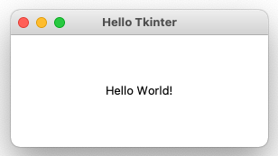
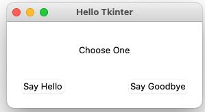
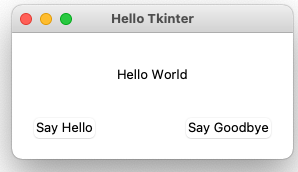
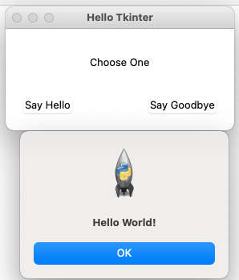
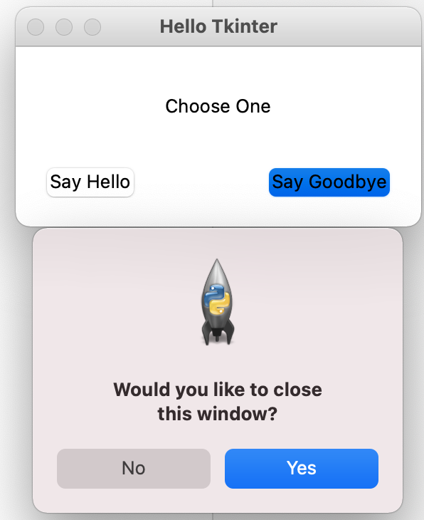
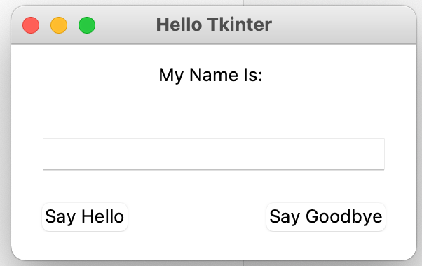

# 初見tkinter
## [說明文件](https://anzeljg.github.io/rin2/book2/2405/docs/tkinter/index.html)
## [tkDoc說明文件](https://tkdocs.com/tutorial/index.html)
## Hello!World

```python

import tkinter as tk

class Window(tk.Tk):
    def __init__(self):
        super().__init__()
        self.title("Hello Tkinter")

        label = tk.Label(self, text="Hello World!")
        label.pack(fill=tk.BOTH, expand=1, padx=100, pady=50)


if __name__ == "__main__":
    window = Window()
    window.mainloop()
        

```



## 互動

```python
import tkinter as tk

class Window(tk.Tk):
    def __init__(self):
        super().__init__()
        self.title("Hello Tkinter")

        self.label = tk.Label(self, text="Choose One")
        self.label.pack(fill=tk.BOTH, expand=1, padx=100, pady=30)

        hello_button = tk.Button(self, text="Say Hello", command=self.say_hello)
        hello_button.pack(side=tk.LEFT, padx=(20, 0), pady=(0, 20))

        goodbye_button = tk.Button(self, text="Say Goodbye", command=self.say_goodbye)
        goodbye_button.pack(side=tk.RIGHT, padx=(0, 20), pady=(0, 20))

    def say_hello(self):
        self.label.configure(text="Hello World!")

    def say_goodbye(self):
        self.label.configure(text="Goodbye! \n (Closing in 2 seconds)")
        self.after(2000, self.destroy)


if __name__ == "__main__":
    window = Window()
    window.mainloop()
```



## 更新元件內容

```python
import tkinter as tk

class Window(tk.Tk):
    def __init__(self):
        super().__init__()
        self.title("Hello Tkinter")
        self.label_text = tk.StringVar()
        self.label_text.set("Choose One")

        self.label = tk.Label(self, textvar=self.label_text)
        self.label.pack(fill=tk.BOTH, expand=1, padx=100, pady=30)

        hello_button = tk.Button(self, text="Say Hello", command=self.say_hello)
        hello_button.pack(side=tk.LEFT, padx=(20, 0), pady=(0, 20))

        goodbye_button = tk.Button(self, text="Say Goodbye", command=self.say_goodbye)
        goodbye_button.pack(side=tk.RIGHT, padx=(0, 20), pady=(0, 20))

    def say_hello(self):
        self.label_text.set("Hello World")

    def say_goodbye(self):
        self.label_text.set("Goodbye! \n (Closing in 2 seconds)")
        self.after(2000, self.destroy)


if __name__ == "__main__":
    window = Window()
    window.mainloop()        

```



## 顯示對話框

```python
import tkinter as tk
import tkinter.messagebox as msgbox

class Window(tk.Tk):
    def __init__(self):
        super().__init__()
        self.title("Hello Tkinter")
        self.label_text = tk.StringVar()
        self.label_text.set("Choose One")

        self.label = tk.Label(self, textvar=self.label_text)
        self.label.pack(fill=tk.BOTH, expand=1, padx=100, pady=30)

        hello_button = tk.Button(self, text="Say Hello", command=self.say_hello)
        hello_button.pack(side=tk.LEFT, padx=(20, 0), pady=(0, 20))

        goodbye_button = tk.Button(self, text="Say Goodbye", command=self.say_goodbye)
        goodbye_button.pack(side=tk.RIGHT, padx=(0, 20), pady=(0, 20))

    def say_hello(self):
        msgbox.showinfo("Hello", "Hello World!")

    def say_goodbye(self):
        self.label_text.set("Window will close in 2 seconds")
        msgbox.showinfo("Goodbye!", "Goodbye, it's been fun!")
        self.after(2000, self.destroy)


if __name__ == "__main__":
    window = Window()
    window.mainloop()
        
```



## 取得使用者的選擇

```python
import tkinter as tk
import tkinter.messagebox as msgbox

class Window(tk.Tk):
    def __init__(self):
        super().__init__()
        self.title("Hello Tkinter")
        self.label_text = tk.StringVar()
        self.label_text.set("Choose One")

        self.label = tk.Label(self, textvar=self.label_text)
        self.label.pack(fill=tk.BOTH, expand=1, padx=100, pady=30)

        hello_button = tk.Button(self, text="Say Hello", command=self.say_hello)
        hello_button.pack(side=tk.LEFT, padx=(20, 0), pady=(0, 20))

        goodbye_button = tk.Button(self, text="Say Goodbye", command=self.say_goodbye)
        goodbye_button.pack(side=tk.RIGHT, padx=(0, 20), pady=(0, 20))

    def say_hello(self):
        msgbox.showinfo("Hello", "Hello World!")

    def say_goodbye(self):
        if msgbox.askyesno("Close Window?", "Would you like to close this window?"):
            self.label_text.set("Window will close in 2 seconds")
            self.after(2000, self.destroy)
        else:
            msgbox.showinfo("Not Closing", "Great! This window will stay open.")


if __name__ == "__main__":
    window = Window()
    window.mainloop()
        

```



## 取得使用者輸入的資訊

```python
import tkinter as tk
import tkinter.messagebox as msgbox

class Window(tk.Tk):
    def __init__(self):
        super().__init__()
        self.title("Hello Tkinter")
        self.label_text = tk.StringVar()
        self.label_text.set("My Name Is: ")

        self.name_text = tk.StringVar()

        self.label = tk.Label(self, textvar=self.label_text)
        self.label.pack(fill=tk.BOTH, expand=1, padx=100, pady=10)

        self.name_entry = tk.Entry(self, textvar=self.name_text)
        self.name_entry.pack(fill=tk.BOTH, expand=1, padx=20, pady=20)

        hello_button = tk.Button(self, text="Say Hello", command=self.say_hello)
        hello_button.pack(side=tk.LEFT, padx=(20, 0), pady=(0, 20))

        goodbye_button = tk.Button(self, text="Say Goodbye", command=self.say_goodbye)
        goodbye_button.pack(side=tk.RIGHT, padx=(0, 20), pady=(0, 20))

    def say_hello(self):
        message = "Hello there " + self.name_entry.get()
        msgbox.showinfo("Hello", message)

    def say_goodbye(self):
        if msgbox.askyesno("Close Window?", "Would you like to close this window?"):
            message = "Window will close in 2 seconds - goodybye " + self.name_entry.get()
            self.label_text.set(message)
            self.after(2000, self.destroy)
        else:
            msgbox.showinfo("Not Closing", "Great! This window will stay open.")


if __name__ == "__main__":
    window = Window()
    window.mainloop()
        


```


	
