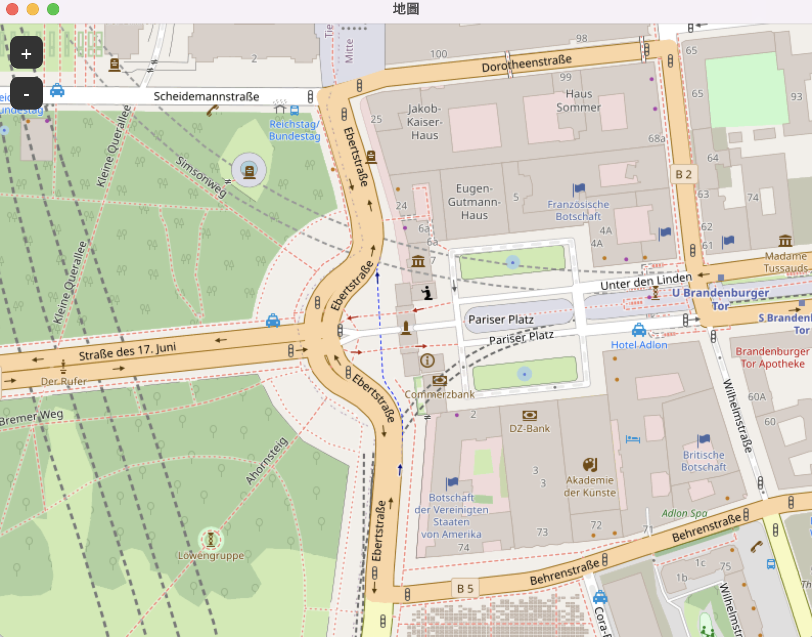
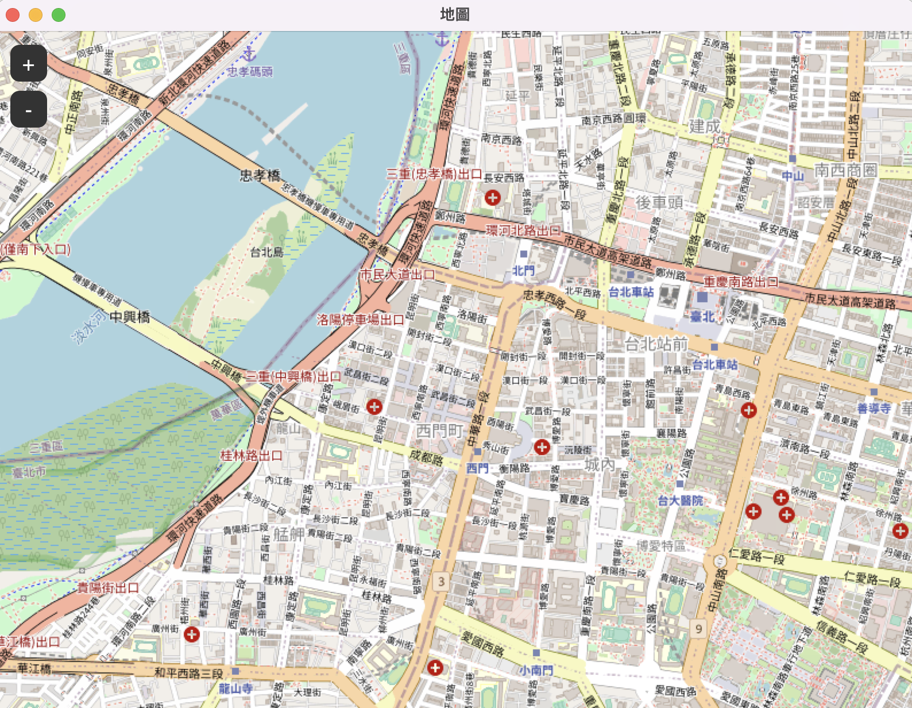
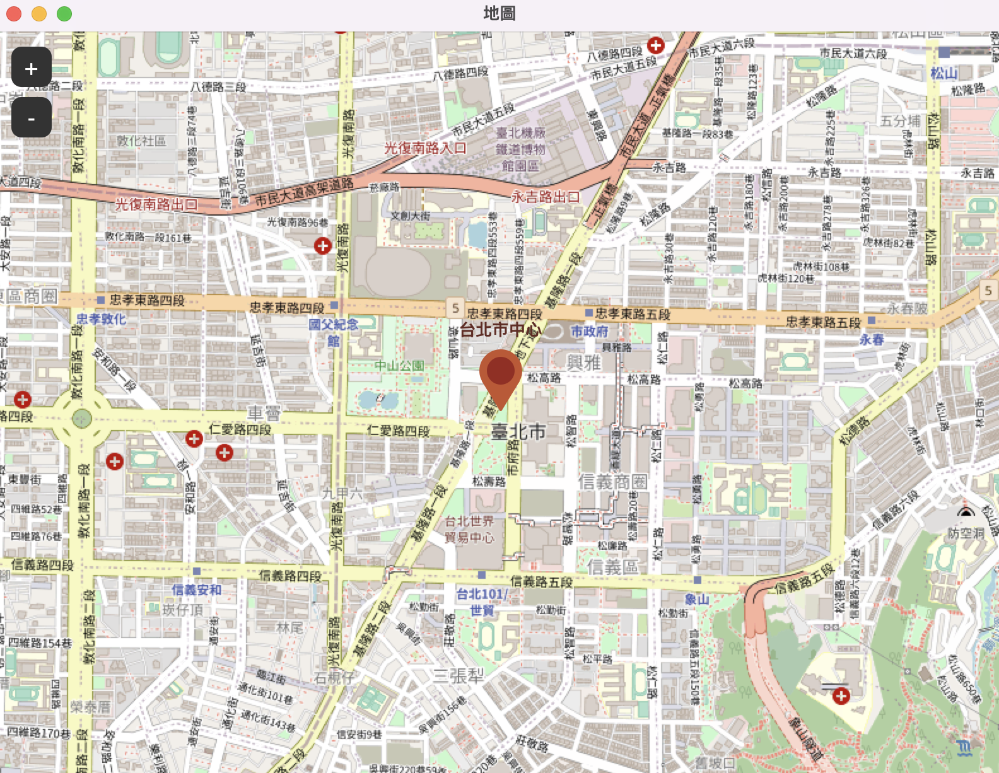
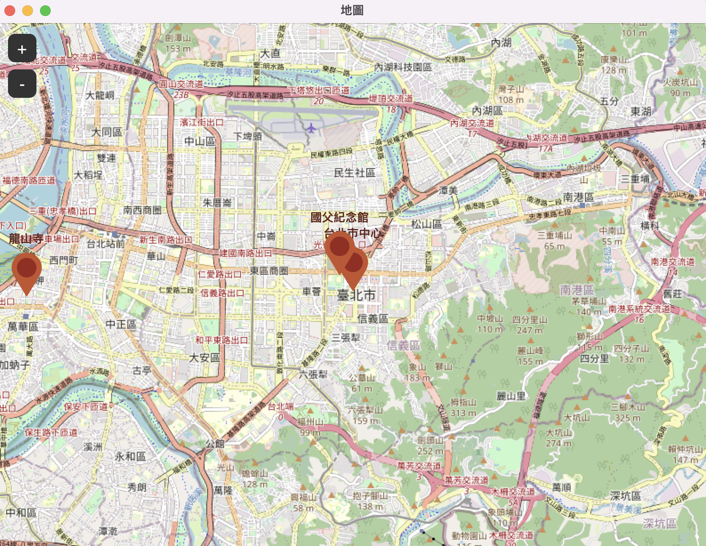

 # tkintermapview
 
 - [參考文件](https://github.com/TomSchimansky/TkinterMapView#importing)
 
 ## 安裝
 
 ```
 $ pip install tkintermapview
 ```
 
 ## 建立預設柏林地址的地圖
 
 ```python
 import tkinter as tk
import tkintermapview as tkmap

class Window(tk.Tk):
    def __init__(self):
        super().__init__()
        #建立地圖
        map_widget = tkmap.TkinterMapView(self,
                                          width=800,
                                          height=600,
                                          corner_radius=0
                                          )
        map_widget.place(relx=0.5, rely=0.5, anchor=tk.CENTER)


if __name__ == "__main__":
    window = Window()
    window.geometry("800x600")
    window.title("地圖")
    window.mainloop()
 ```
 
 
 
 ## 透過座標設定位置
 
 - map_widget.set_position(48.860381, 2.338594)  Paris, France
- map_widget.set_zoom(15)

```python
import tkinter as tk
import tkintermapview as tkmap

class Window(tk.Tk):
    def __init__(self):
        super().__init__()
        #建立地圖
        map_widget = tkmap.TkinterMapView(self,
                                          width=800,
                                          height=600,
                                          corner_radius=0
                                          )
        map_widget.place(relx=0.5, rely=0.5, anchor=tk.CENTER)
        map_widget.set_position(25.038128318756307, 121.56306490172479) #台北市位置
        map_widget.set_zoom(15) #設定顯示大小


if __name__ == "__main__":
    window = Window()
    window.geometry("800x600")
    window.title("地圖")
    window.mainloop()

```


## 透過地址設定位置
- 只可以是英文
- 中文轉英文(只限城市)

```python
import tkinter as tk
import tkintermapview as tkmap

class Window(tk.Tk):
    def __init__(self):
        super().__init__()
        #建立地圖
        map_widget = tkmap.TkinterMapView(self,
                                          width=800,
                                          height=600,
                                          corner_radius=0
                                          )
        map_widget.place(relx=0.5, rely=0.5, anchor=tk.CENTER)
        map_widget.set_address("Taipei City ,Taiwan") #台北市位置
        map_widget.set_zoom(15) #設定顯示大小


if __name__ == "__main__":
    window = Window()
    window.geometry("800x600")
    window.title("地圖")
    window.mainloop()

```



## 製作1個標示

- marker=True

```python
import tkinter as tk
import tkintermapview as tkmap

class Window(tk.Tk):
    def __init__(self):
        super().__init__()
        #建立地圖
        map_widget = tkmap.TkinterMapView(self,
                                          width=800,
                                          height=600,
                                          corner_radius=0,
                                          )
        map_widget.place(relx=0.5, rely=0.5, anchor=tk.CENTER)
        marker_1 = map_widget.set_position(25.038128318756307, 121.56306490172479,marker=True) #台北市位置
        map_widget.set_zoom(15) #設定顯示大小
        marker_1.set_text("台北市中心")
        # marker_1.set_position(48.860381, 2.338594)  # 改變位置
        # marker_1.delete()刪除

if __name__ == "__main__":
    window = Window()
    window.geometry("800x600")
    window.title("地圖")
    window.mainloop()


```



## 建立多個標示

```
#使用set_marker(52.516268, 13.377695, text="Brandenburger Tor")
# set a position marker
marker_2 = map_widget.set_marker(52.516268, 13.377695, text="Brandenburger Tor")
marker_3 = map_widget.set_marker(52.55, 13.4, text="52.55, 13.4")
# marker_3.set_position(...)
# marker_3.set_text(...)
# marker_3.delete()
```

### 內建的一些引數名稱
#### .set_marker(), .set_address(),._set_position()可以使用的引數

- text
- font
- image (PhotoImage)
- image_zoom_visibility 圖片要顯示在zoom的級數,必需是tuple,例如(0,float('inf'))
- marker_color_circle
- marker_color_outside
- text_color
- command 事件,必需要有1個參數(1個),接收傳過來的marker

#### 影像可以顯示或隱藏

- marker.hide_image(True)
- marker.hide_image(False)

#### 檢查圖片顯示或隱藏

- marker.image_hidden

#### 儲存更多資料在marker內

- marker.data

#### 多個marker和事件處理

```python
import tkinter as tk
import tkintermapview as tkmap

class Window(tk.Tk):
    def __init__(self):
        super().__init__()
        #建立地圖
        map_widget = tkmap.TkinterMapView(self,
                                          width=800,
                                          height=600,
                                          corner_radius=0,
                                          )
        map_widget.place(relx=0.5, rely=0.5, anchor=tk.CENTER)
        marker_1 = map_widget.set_position(25.038128318756307, 121.56306490172479,marker=True) #台北市位置
        map_widget.set_zoom(13) #設定顯示大小
        marker_1.set_text("台北市中心")

        marker_2 = map_widget.set_marker(25.040978888281742, 121.56049337427295,text ="國父紀念館",command=self.click1) #國父紀念館
        marker_2.data = {'a':15,'b':'紀念館'}

        marker_3 = map_widget.set_marker(25.037249827231033, 121.50009738141222,text ="龍山寺",command=self.click2) #國父紀念館
        marker_3.data = {'a':18,'b':'紀念館'}

    def click1(self,marker):
        print("click1")
        print(marker.__class__)
        print(marker.data)

    def click2(self,marker):
        print("click2")
        print(marker.__class__)
        print(marker.data)

if __name__ == "__main__":
    window = Window()
    window.geometry("800x600")
    window.title("地圖")
    window.mainloop()

```



