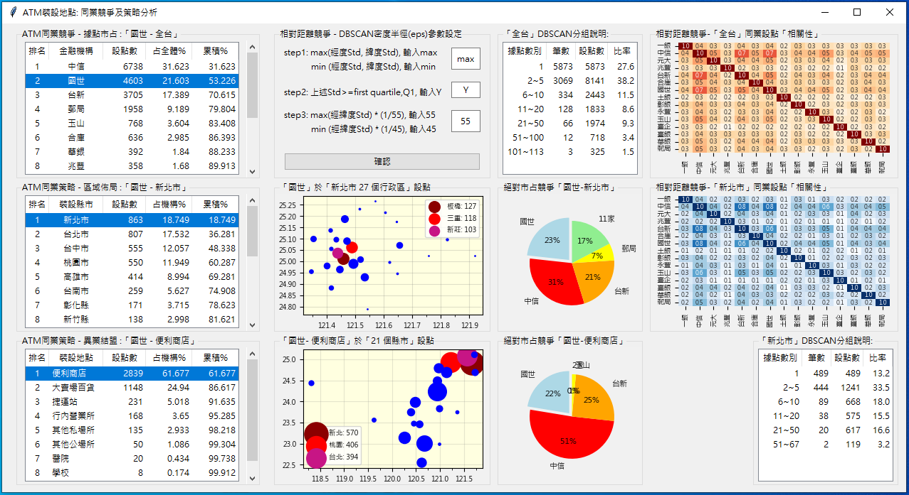
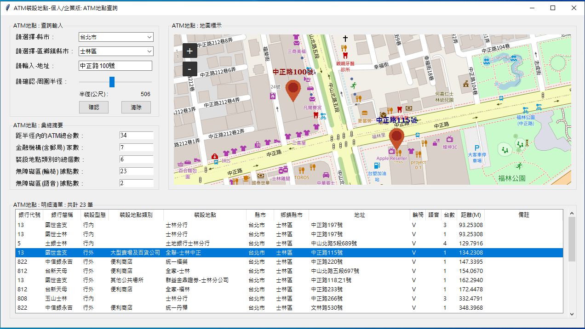

# ATM設點查詢與分析

## ATM設點競爭與策略分析

## ATM裝設地點查詢

### 一、專案組名：創價組
### 二、專案組員：張雯嬌
### 三、專案網址：
- https://github.com/wenchang0416/__sideProjectATM__

### 四、專案目的：ATM設點競爭與策略分析
1. 實體通路「效益評估」：周圍密度 / 據點市占，相對競爭實質聚焦
   - 據點市占率：ATM據點占全體金融業之比率 (絕對多數競爭)
   - 周圍密度性：ATM據點於周圍半徑內之數量 (相對距離競爭)
2. 實體通路「價值轉型」：異業結盟 / 服務加值，雙贏策略綜效發揮
   - 區域性佈局：全台各直轄市、縣市
   - 結盟／加值：異業結盟 (通路跨業拓展)、行內處所、服務加值(客戶關係維護)
3. 程式集：mainML.py、dataSourceML.py

### 五、專案目的：ATM裝設地點查詢
1. 使用時機：
   - 民眾使用ＡＴＭ提現、補摺等功能時，可以透過本視窗，快速搜尋到鄰近地點周圍ＡＴＭ的地理位置資訊。
   - 銀行規劃ＡＴＭ設點、撤點等決策時，可以透過本視窗，快速掌握到鄰近地點周圍ＡＴＭ的同業佈點資訊。
2. 程式集：main.py、dataSource.py

### 六、資料說明：
1. 政府資料開放平台的「全民共享普發現金ATM裝設地點明細」檔。
2. 資料限制: 
   - 僅限政府指定參與普發現金的金融機構（含郵局）所設置的ATM機台。
   - 參與機構：臺銀、土銀、合庫、一銀、華銀、彰銀、兆豐、企銀、郵局、
               國世、台新、中信、玉山、元大、永豐。
               共計 14家銀行及 1家郵局。
   - 未含機構：台北富邦…　
3. 資料範圍：
  涵蓋上述指定金融機構之全台各地ATM。
