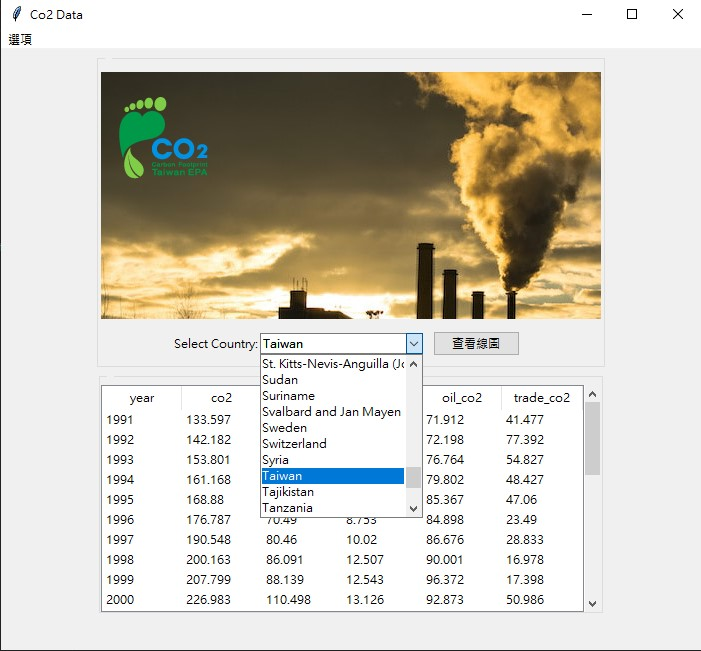
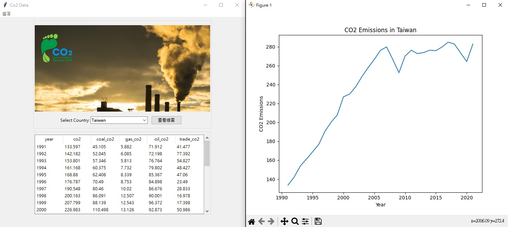

## Co2碳排放

### 一、專案組名：碳排放
### 二、專案組員：陳瑞涓、陳彥廷

### 三、專案說明：
1. 將各國關於碳排放相關的數據以視窗及圖表的方式呈現，幫助使用者探索各國的碳排放數據。

2. 主程式部分，我們使用視窗作為界面，將控制按鈕設計成一個可拉選各國的下拉選單，當使用者選擇一個國家時，會顯示該國的各項碳排放相關數據。為了更直觀地顯示各國碳排放的趨勢，我們增加一個顯示線圖的功能。讓使用者可以在選擇國家後點擊這個功能，然後程式將彈出一個新的視窗，顯示該國的碳排放數據的線圖。
讓使用者能夠輕鬆地查看和比較各國的碳排放數據。透過視窗化的設計，使用者可以更直觀地了解碳排放的趨勢和變化。

### 四、資料說明：
此專案所使用的資料取自世界各國碳排放之公開資料檔，網址:https://github.com/owid/co2-data
