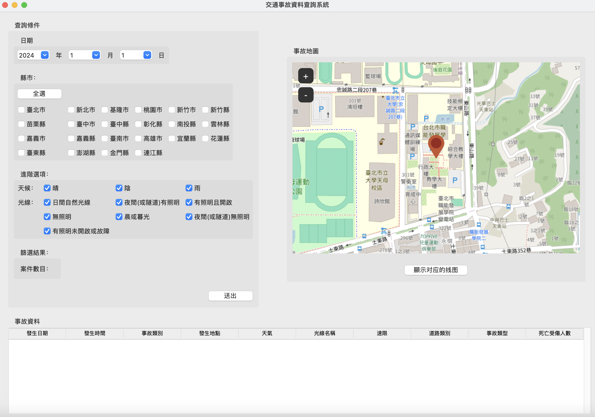
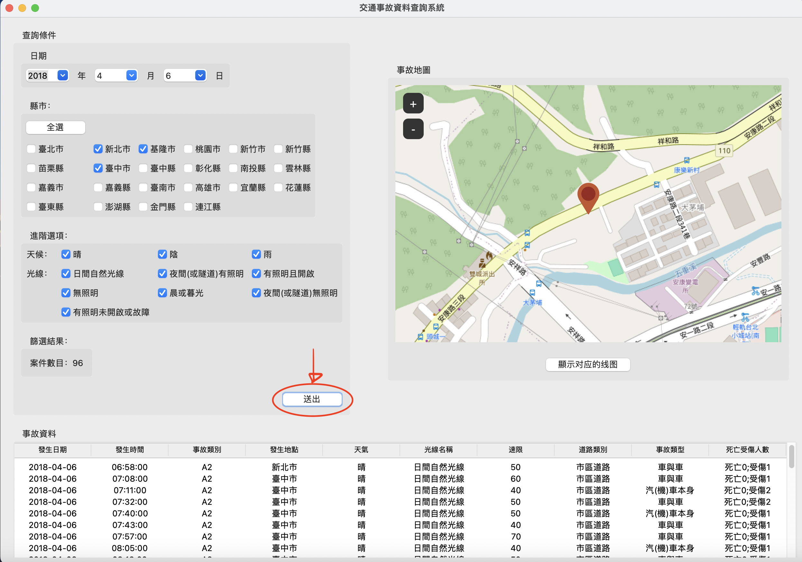
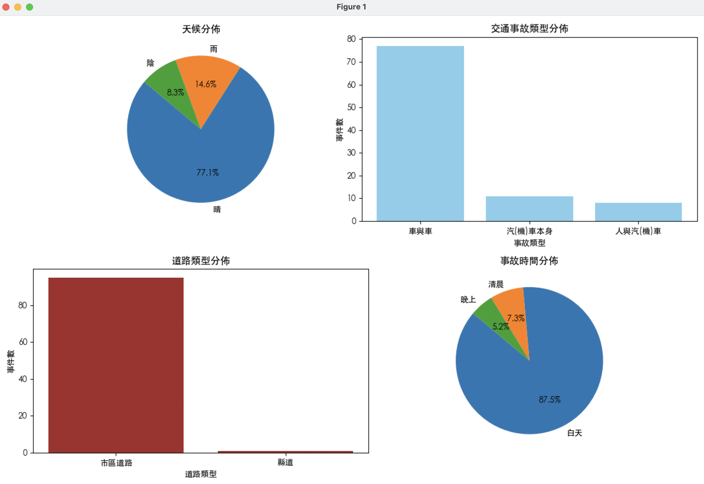

## 一、專案主題: 交通事故查詢地圖
## 二、專案小組人員: 04-毛栩櫟、16-陳名畯、19-林佑穎
## 三、專案網址:
https://github.com/mjchen004/traffic_incident
## 四、目標方法:
### 1.載入單一交通事故的事故資訊
### 2.將事故地點以google地圖圖像化
### 3.交通事故比例分析
## 五、功能簡介:
* 查詢條件(日期):用戶可透過下拉選單選擇特定一天發生的事故列表

* 查詢條件(縣市):用戶可透過勾選欄位選擇事件發生的縣市，或者點選全選來選擇所有的縣市

* 進階篩選：用戶可透過勾選欄位選擇天氣與光線狀態來篩選事故列表

* 篩選結果：呈現在上述條件所發生的事故數量

* 事故資料：呈現篩選後的事故資料

* 事故地圖：呈現篩選查詢後的所有事故發生地點

* 顯示對應的線圖：呈現篩選資料後的交通事故類型、天候分佈、道路類型分佈、事故時間分佈之圖表

## 六、資料來源:
傷亡道路交通事故資料( [政府資料開放平台](https://data.gov.tw/datasets/search?p=1&size=10&s=_score_desc&rft=%E4%BA%A4%E9%80%9A%E4%BA%8B%E6%95%85) )

## 七、資料格式:
* 各年度資料csv檔案
* 顯示事故資料類型包含:
  
> 發生日期 | 發生時間 | 事故類別 | 發生地點 | 天氣 | 光線名稱 | 速限 | 道路類別 | 事故類型 | 死亡受傷人數

1. 進入的第一視窗介面
### 
2. 篩選條件後進行查詢
### 
3. 交通事故類型、天候分佈、道路類型分佈、事故時間分佈之圖表
### 
4. 交通事故發生之地點呈現
### 

# 成果影片連結:
> ## [Youtube連接](https://www.youtube.com/watch?v=-T5VEKr6J7M)
