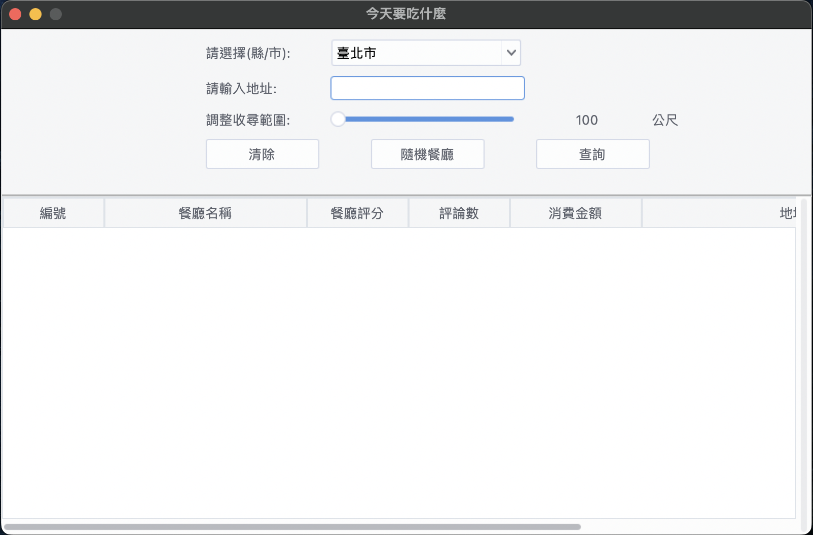
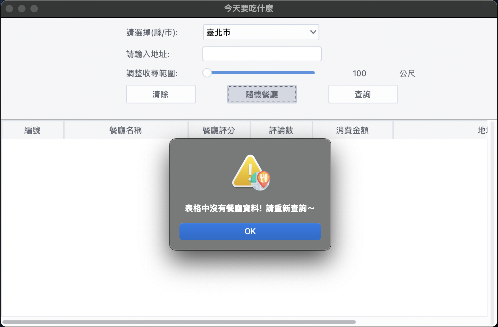
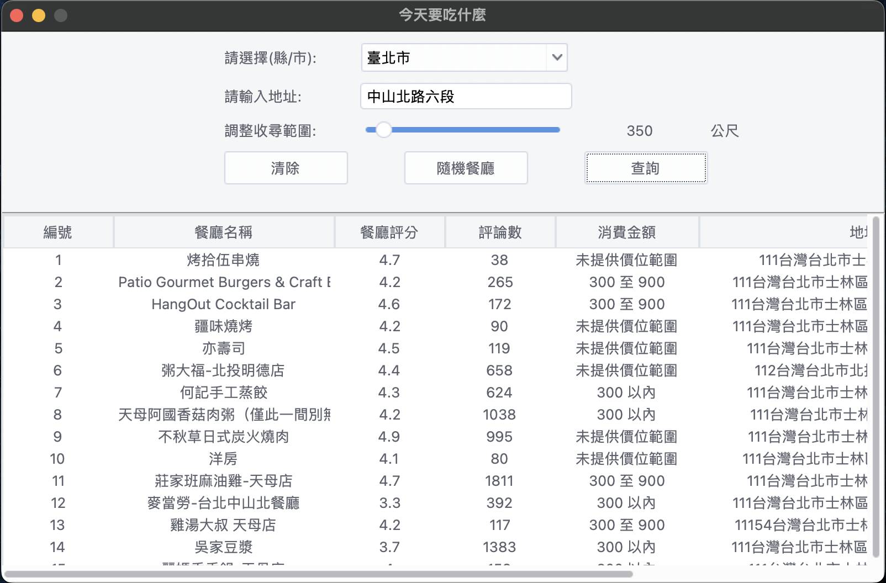
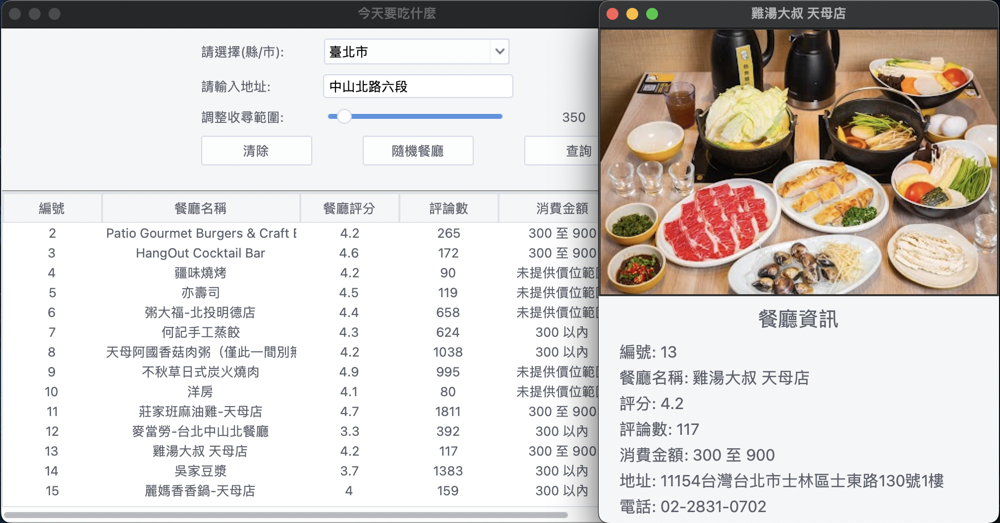
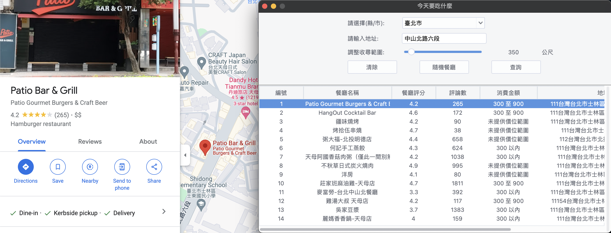

## 一、專案組名： 今天要吃什麼

## 二、專案組員：蔡忻辰、陳萱、林郁雯

## 三、專案網址：

* https://github.com/RogerShin/Restaurant_Map_Search

## 四、專案目的：

>"**今天要吃什麼**"是一個基於Python和Tkinter的桌面應用程式，旨在根據地理位置和特定需求找到合適的餐廳，幫助用戶決定今天要去哪裡用餐。當朋友問「要吃什麼？」時，很多人總是回答「隨便」或「都可以」，這個應用程式正是為了解決這種煩惱。透過指定範圍查詢和隨機選擇功能，用戶可以輕鬆找到附近的餐廳，並根據自己的需求進行篩選。 同時，本應用主要針對那些在選擇用餐地點時經常感到猶豫不決的人群。無論是家庭聚餐、朋友聚會，還是獨自用餐，用戶都能使用這個應用找到合適的餐廳選項。

### 此專案主要目的是提供一個簡單直觀的介面，讓用戶可以：

1. 查詢餐廳：

    * 用戶可以選擇縣市並輸入地址，然後設置查詢範圍，應用程式將顯示該範圍內的所有餐廳。

2. 範圍設置：

    * 用戶可以使用滑桿來調整查詢範圍（以公尺為單位），查看不同範圍內的餐廳選項。

3. 顯示餐廳資訊：

    * 顯示餐廳的名稱、評分、評論數量、價格水平、地址和電話號碼等詳細資訊。

4. 隨機選擇餐廳：

    * 當用戶不確定要選擇哪家餐廳時，可以使用“隨機餐廳”功能，應用程式會從查詢結果中隨機選擇一家餐廳。

5. 清除功能：

    * 用戶可以清除當前的查詢條件和結果，重新進行查詢。

## 五、功能簡述：

>* 下拉選單：用戶可以從下拉選單中選擇縣市。
>
>* 地址輸入：用戶可以手動輸入地址以便進行查詢。
>* 範圍滑桿：用戶可以調整查詢範圍，從100公尺到3000公尺。
>* 查詢按鈕：用戶點擊查詢按鈕後，應用程式將顯示指定範圍內的餐廳。
>* 隨機選擇：用戶點擊隨機選擇餐廳按鈕後，從查詢結果中隨機顯示一家餐廳。
>* 清除按鈕：用戶可以清除當前的查詢和結果。
>* 餐廳列表：應用程式會以表格形式顯示查詢結果，並且支持垂直和水平滾動。

## 六、資料說明：

### 資料來源：

1. 台灣地區縣市名稱JSON文件( [國土測繪中心全球資訊網](https://api.nlsc.gov.tw/other/ListCounty) )

2. Google API

### 資料格式：

* countyname JSON文件

* 顯示餐廳資料欄位包括：

        餐廳名稱 | 餐廳評分 | 評論數量 | 消費金額 | 餐廳地址 | 餐廳電話號碼

---
# 視窗介面

---
# 彈出警告視窗

---
# 資料表內顯示資料

---
# 隨機餐廳按鈕

---
# 點擊資料表內的餐廳，連接google map網頁

---
# 成果影片連結:
> ## [Youtube連接](https://youtu.be/y_qhUJaPawg)