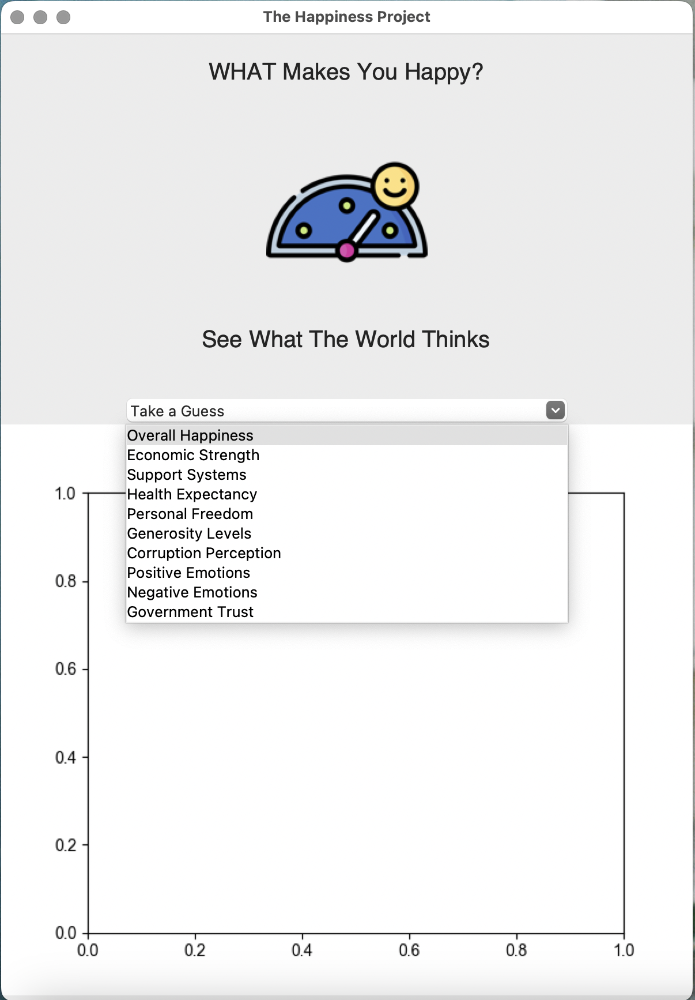
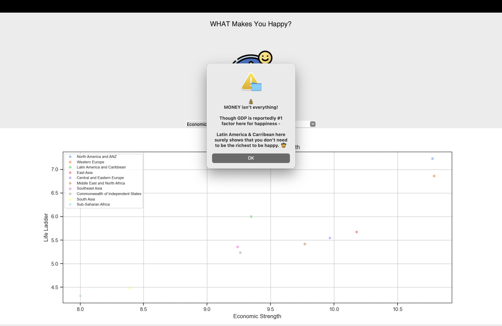
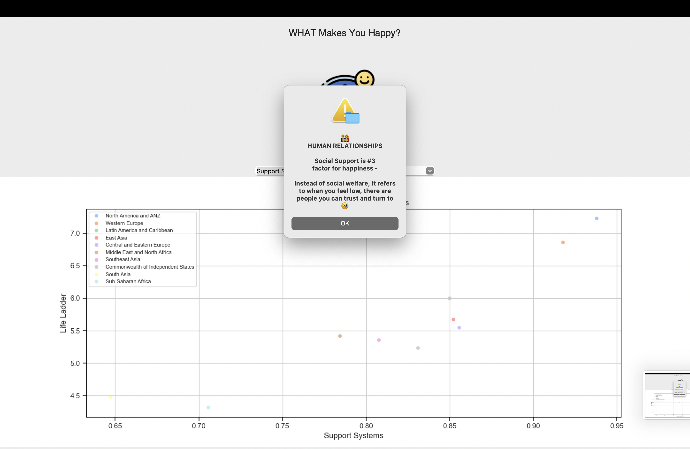
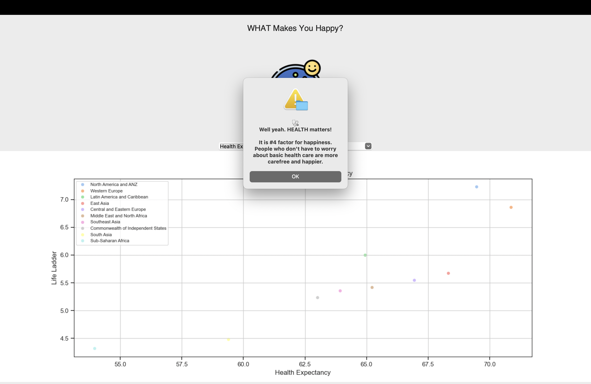
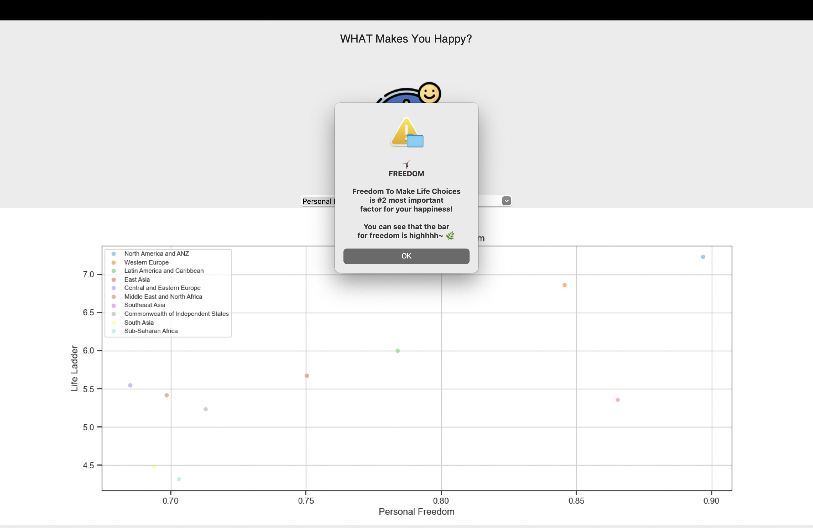
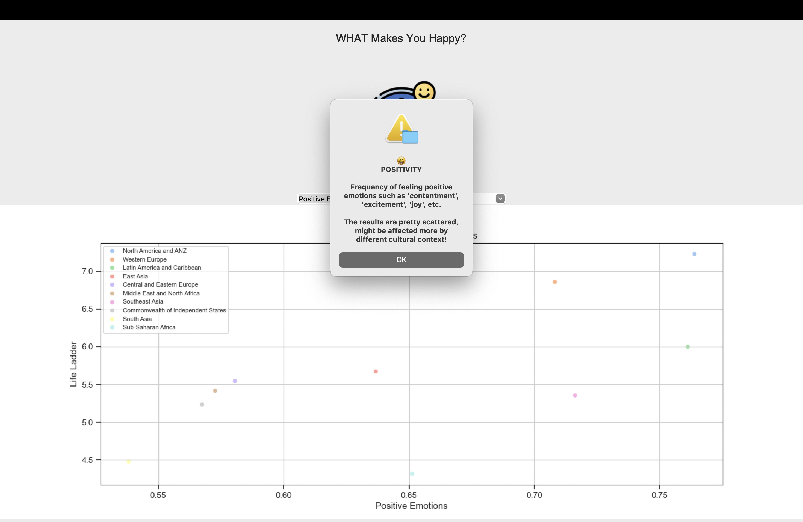

### 一、專案組名 - The Happiness Project 人生快樂專案
### 二、專案組員
- 黃靖雯
- 王愷立
- 林見恆
### 三、專案程式碼 & Video Demo
- [Python Code](./index.py)
- [Video Demo](https://youtu.be/p6p-UhxdzWU)
### 四、專案目的：分析影響「快樂」的各項生活指標及重要性
### 五、專案目的
- 透過全球各地區政經及社會發展差異，分析出影響現代人類心理健康的主要因素。
#### 使用時機：
- 當使用者對生活感到厭倦時，可藉由此工具察覺生活環境潛在影響因素，進而提升生活及心理健康品質。
### 六、資料說明：
- ["World Happiness Report, 2005-Present" on Kaggle](https://www.kaggle.com/datasets/usamabuttar/world-happiness-report-2005-present/data)
#### 資料說明:
- **Log GDP per capita** is in terms of Purchasing Power Parity (PPP) adjusted to a constant 2017 international dollars, taken from the World Development Indicators (WDI) by the World Bank (version 17, metadata last updated on January 22, 2023). See Statistical Appendix 1 for more details. GDP data for 2022 are not yet available, so we extend the GDP time series from 2021 to 2022 using country-specific forecasts of real GDP growth from the OECD Economic Outlook No. 112 (November 2022) or, if missing, from the World Bank’s Global Economic Prospects (last updated: January 10, 2023), after adjustment for population growth. The equation uses the natural log of GDP per capita, as this form fits the data significantly better than GDP per capita.
- The time series for **Healthy life expectancy** at birth is constructed based on data from the World Health Organization (WHO) Global Health Observatory data repository, with data available for 2005, 2010, 2015, 2016, and 2019. To match this report’s sample period (2005-2022), interpolation and extrapolation are used. See Statistical Appendix 1 for more details.
- Social support (0-1) is the national average of the binary responses (0=no, 1=yes) to the Gallup World Poll (GWP) question “If you were in trouble, do you have relatives or friends you can count on to help you whenever you need them, or not?”
- **Freedom to make life choices (0-1)** is the national average of binary responses to the GWP question “Are you satisfied or dissatisfied with your freedom to choose what you do with your life?”
- **Generosity** is the residual of regressing the national average of GWP responses to the donation question “Have you donated money to a charity in the past month?” on log GDP per capita.
- **Perceptions of corruption (0-1)** are the average of binary answers to two GWP questions: “Is corruption widespread throughout the government or not?” and “Is corruption widespread within businesses or not?” Where data for government corruption are missing, the perception of business corruption is used as the overall corruption perception measure.
- **Positive affect** is defined as the average of previous-day effects measures for laughter, enjoyment, and interest. The inclusion of interest (first added for World Happiness Report 2022), gives us three components in each of positive and negative affect, and slightly improves the equation fit in column 4. The general form for the affect questions is: Did you experience the following feelings during a lot of the day yesterday?
- **Negative affect** is defined as the average of previous-day effects measures for worry, sadness, and anger.

### 七、MVP視窗示意：

