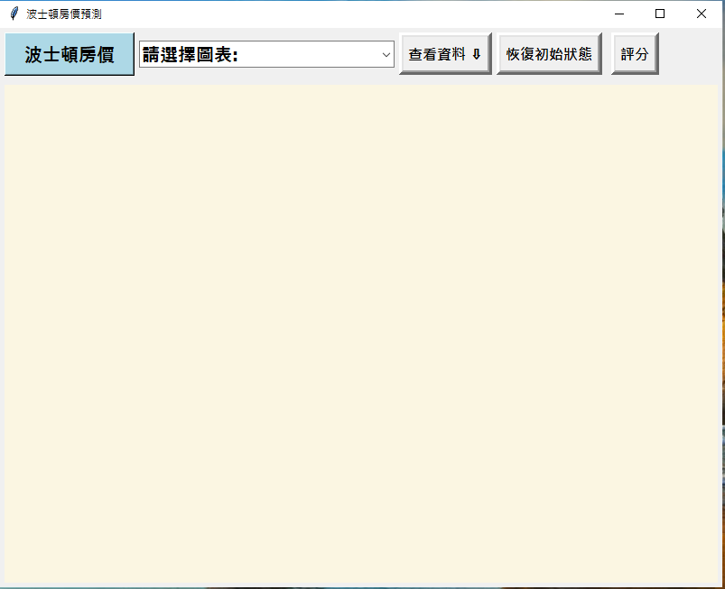
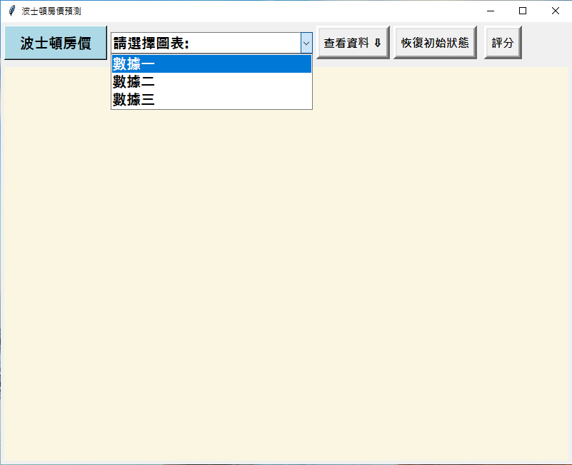
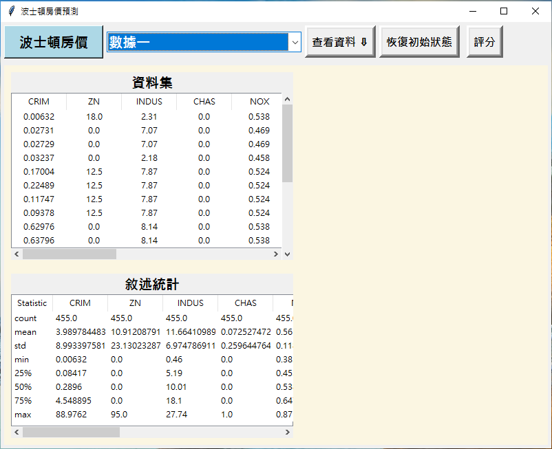
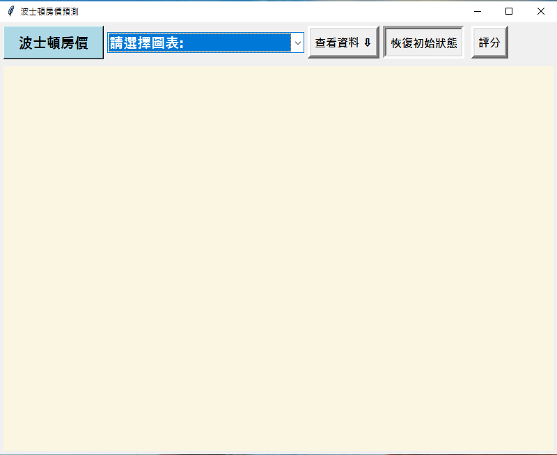
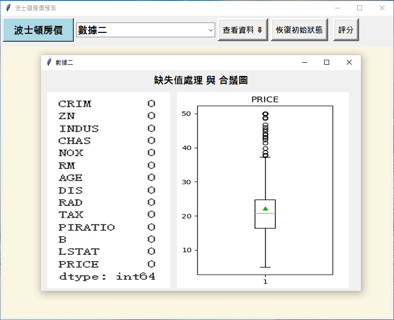
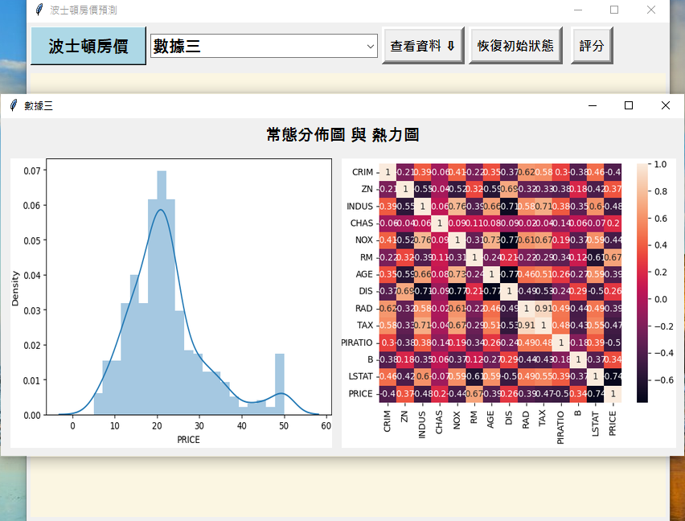
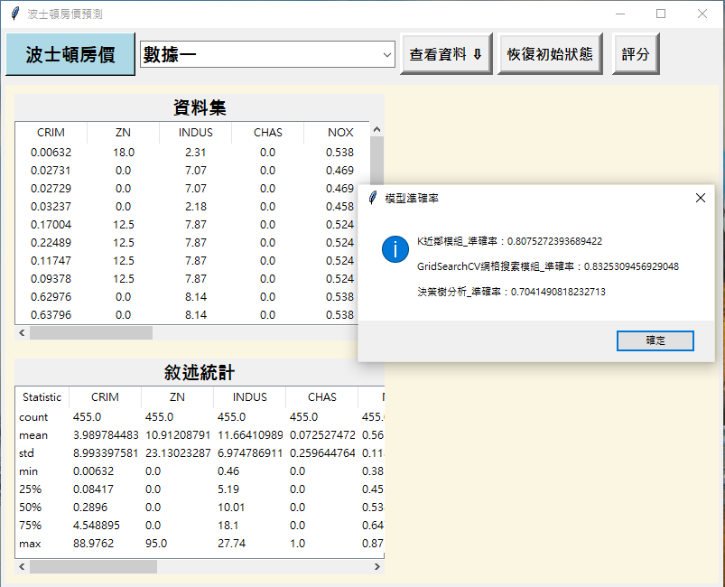
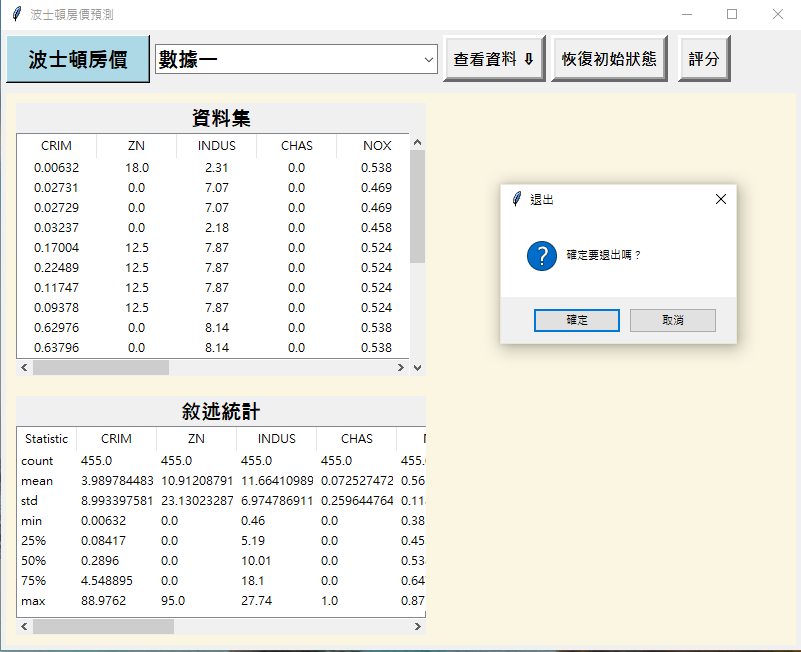

## 波士頓房價預測

### 組員: 田恭豪

---

### 資料來源:
原先在Scikit-Learn的Bostion Housing Dataset(現在已經下架)的train_dataset(訓練集)。

### 專案目的: 
以波士頓房價訓練集，體驗監督式學習的分類法，將資料區分為測試和訓練的資料堆，從訓練的資料中定義特徵變數的欄位作為x，房價欄位作為y，找出x和y之間的關係，並把這個關係用測試的資料做驗證，確認我們找出的房價特徵是否能夠準確預測房價。

### 使用說明
目前為透過簡易的視窗介面呈現資料集分析圖表，以及模型評分，點擊下拉式選單從中選擇不同選項得到各種數據圖表，按下分數按鈕可以了解模型分數。

---

## 視窗介面

### 1.初始畫面

### 2.下拉式選單

### 3.數據一

### 4.移除數據一按鈕

### 5.數據二內容

### 6.數據三內容

### 7.模型分數

### 8.離開前提醒

---

### 欄位名稱說明
CRIM: 犯罪率  
ZN: 住宅用地比例超過 25,000 平方英尺的比例  
INDUS: 每個城鎮的非零售業比例  
CHAS: 查爾斯河虛擬變量 (如果邊界是河流則為1;否則為0)  
NOX: 一氧化氮濃度（百萬分之一）  
RM: 每個住宅的平均房間數  
AGE: 1940年以前建成的自有住房比例  
DIS: 到波士頓五個就業中心的加權距離  
RAD: 徑向高速公路的可達性指數  
TAX: 每 10,000 美元的全值財產稅率  
PTRATIO: 城鎮的師生比例  
B: 1000(Bk - 0.63)^2，其中Bk是城鎮非裔比例  
LSTAT: 人口中地位低下者的百分比  
PRICE: 房屋價格的中位數  

---

### [影片連結](https://youtu.be/7XZ0tEzBzfE)