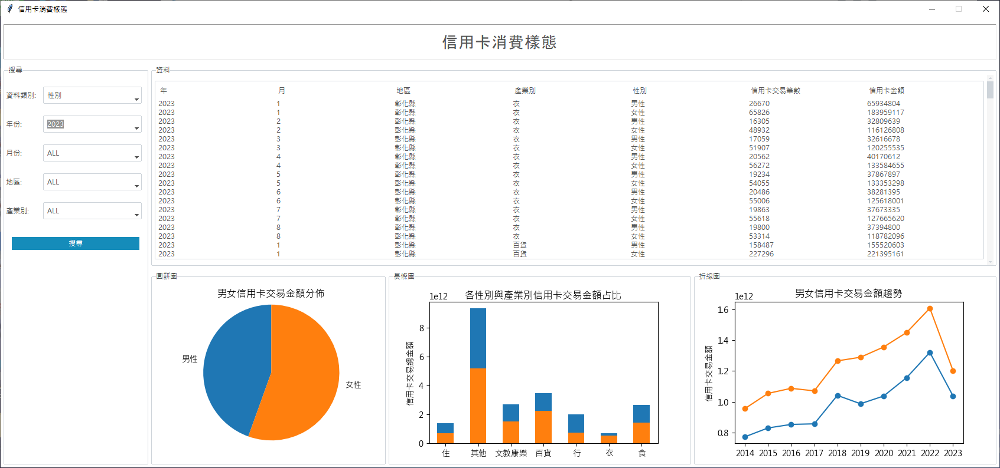
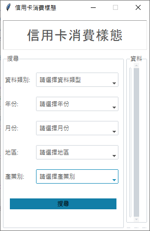
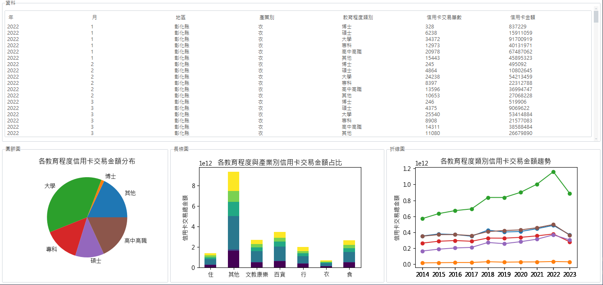
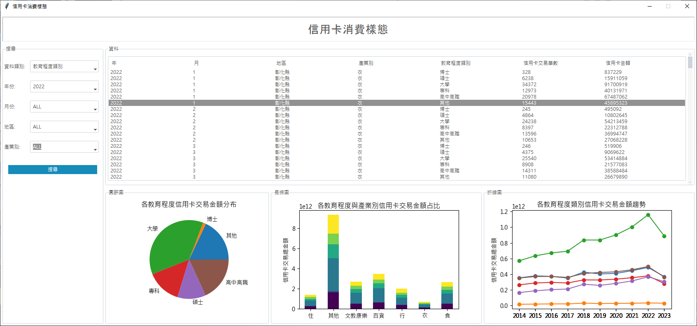
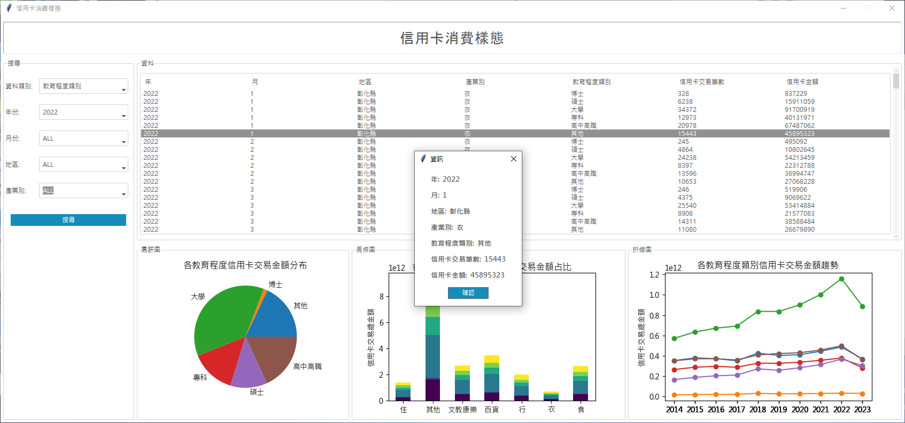

# 信用卡消費樣態

## 初始畫面

    依照不同需求，選擇相應資料：
    1. 資料類別 [必選]：
        - 職業類別
        - 年收入
        - 教育程度類別
        - 性別
        - 年齡層
    2. 年份 [必選]：
        2014-2023
    3. 月份：
        1-12月,ALL
    4. 地區：
        各縣市,ALL
    5. 產業別：
        食,衣,住,行,文教康樂,百貨,其他,ALL
   
## 顯示結果
  

## 完整畫面
### 一、

### 二、

## 專題組員： 
盧宗基 林玫蓀 李亦宣
## 專題目的：
依性別、職業、年齡層、教育程度及年收入等多方面因素進行分析，透過資料視覺化呈現消費者使用信用卡的消費習慣性與趨勢。
## 資料說明：
1. 資料來源：聯合信用卡處理中心Open API
2. 資料範圍：2014年1月－2023年8月
3. 程式：main.py、data.py

