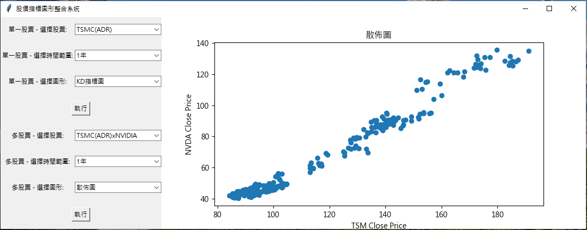
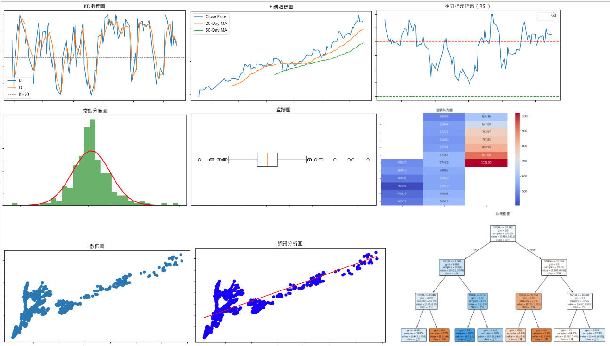

# 股價指標圖形整合系統
## 啟始畫面

## 圖形種類

## 一、專案組名：股價指標圖形整合系統
## 二、專案組員：周筱蘭
## 三、專案網址：
   * https://github.com/joanna0511/joanna_window/tree/main/Homework/issue264
## 四、專案說明：
_______
## 股價整合系統

   * 本股價整合系統是一款基於 Python 的圖形化應用程式，旨在為使用者提供便捷的股票數據分析工具。透過此系統，使用者可以選擇不同的股票及時間範圍，並生成多種圖表， 以視覺化方式呈現股票的歷史數據和趨勢。該程式使用了多個 Python 庫，如 Tkinter、yfinance、Matplotlib 和 Scikit-learn，來實現其功能。

========
### 功能特點
========
    
   1. 多股票選擇

       * 使用者可以選擇多種知名股票，包括 TSMC (ADR)、NVIDIA 和 Apple，並且支持組合股票的比較分析，如 TSMC (ADR) x NVIDIA 以及 TSMC (ADR) x Apple 等。

   2. 多種圖表類型

        * 本系統提供了三種主要圖表類型：散佈圖、迴歸分析圖和決策樹圖。這些圖表能夠幫助使用者深入了解不同股票之間的關聯和趨勢。

        * 散佈圖：顯示兩檔股票價格之間的相關性。

        * 迴歸分析圖：展示兩檔股票價格之間的線性回歸關係，幫助預測。

        * 決策樹圖：利用決策樹演算法，根據一檔股票的價格變動來預測另一檔股票的漲跌情況。

   3. 多時間範圍選擇

        * 使用者可以選擇 1 年、3 年或 5 年的時間範圍，以獲取所選股票的歷史數據。程式會自動從 yfinance 獲取相應時間範圍內的股票數據。 

   
   4. 圖形化介面

        * 系統使用 Tkinter 庫構建圖形化使用者介面，使操作簡單直觀。使用者只需選擇所需的股票、時間範圍和圖表類型，然後點擊“執行”按鈕即可生成圖表。

        * 生成的圖表會顯示在介面右側，方便使用者進行觀察和分析。

        
========
### 技術細節
========

   * Tkinter: 用於構建圖形化使用者介面，提供下拉選單、按鈕等控制元件，方便使用者操作。

   * yfinance: 用於從 Yahoo Finance 獲取股票歷史數據，支持多種股票和時間範圍的查詢。

   * Matplotlib: 用於繪製各種圖表，包括散佈圖、迴歸分析圖和決策樹圖。

   * Scikit-learn: 用於進行迴歸分析和決策樹建模，提供強大的機器學習功能。

========
### 使用說明
========

   1. 啟動程式後，選擇所需的股票和時間範圍。

   2. 選擇要生成的圖表類型（散佈圖、迴歸分析圖或決策樹圖）。

   3. 點擊“執行”按鈕，程式將自動從網絡獲取數據並生成相應的圖表。

   4. 生成的圖表會顯示在介面右側，使用者可以直接觀察分析結果。

本系統適合需要分析股票數據的金融從業者、投資者和研究人員，能夠幫助他們快速掌握股票市場的變化和趨勢，做出更明智的投資決策。

Youtube影片連結：https://youtu.be/JtN4NGMQL0U
_______
