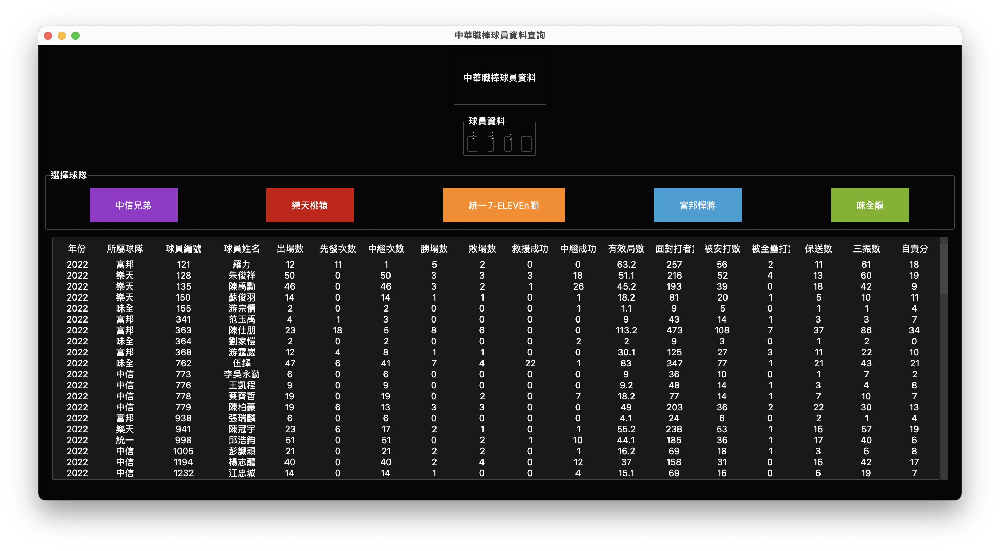
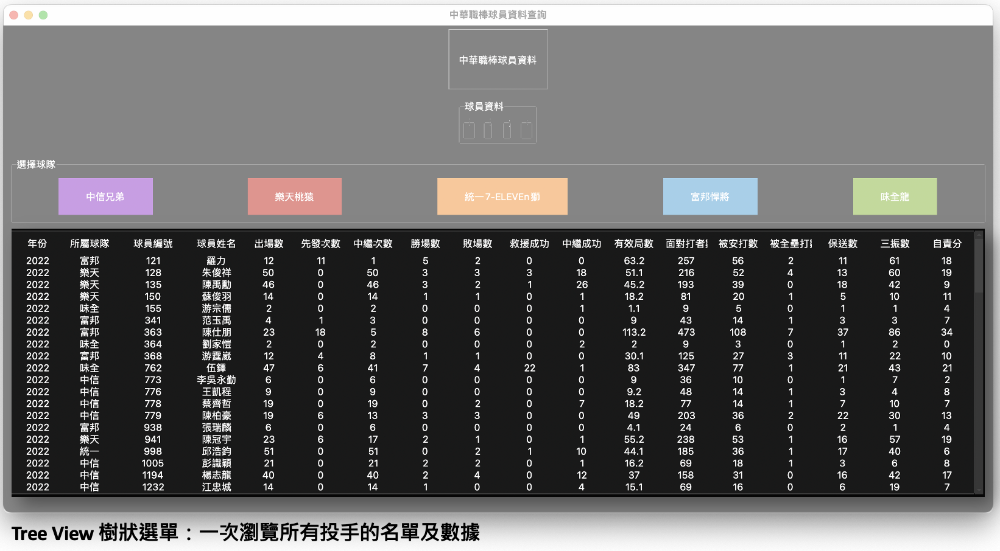
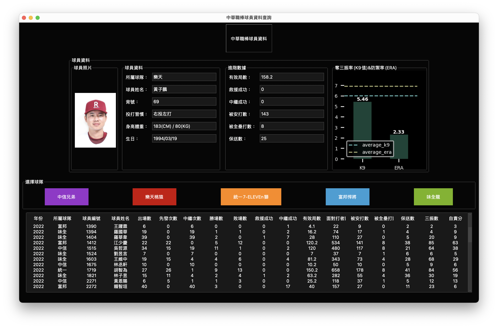
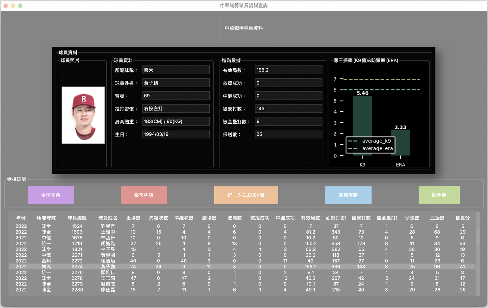
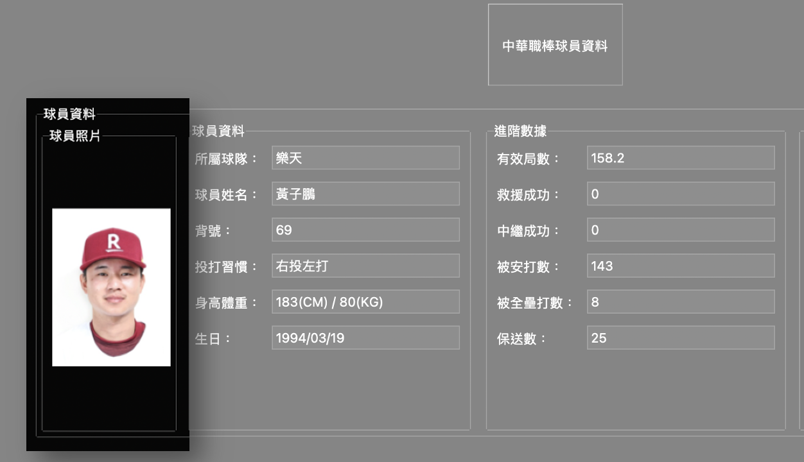
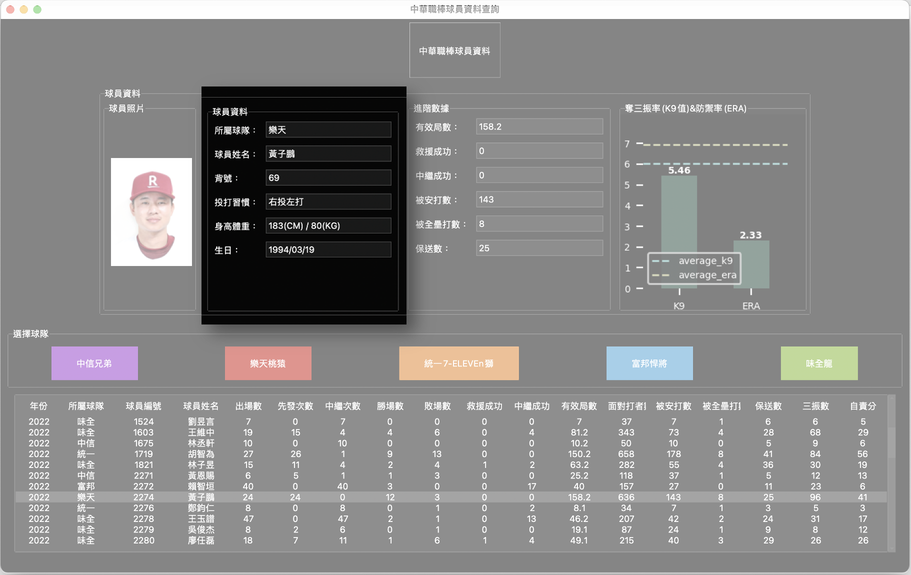
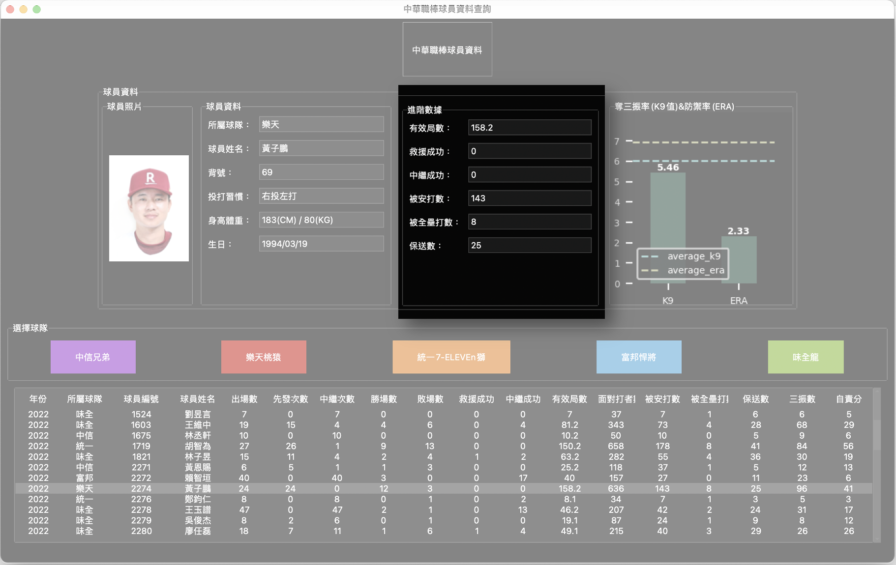
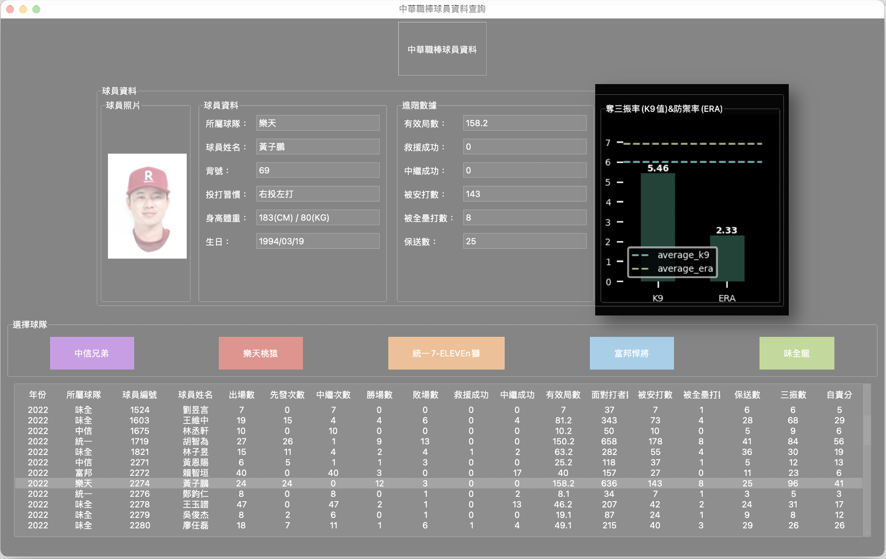
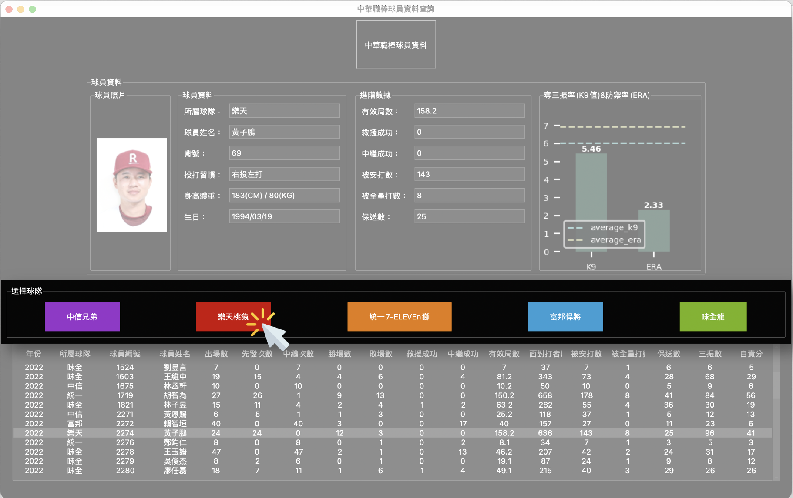
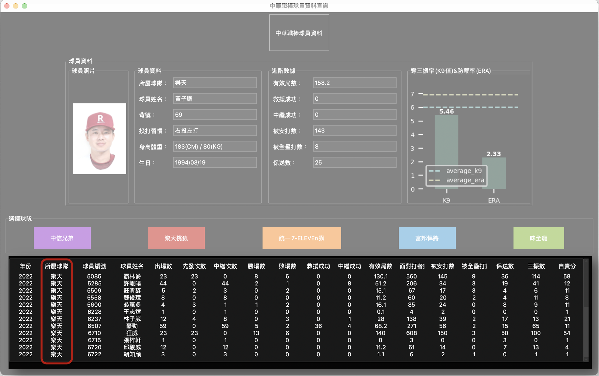

## 中華職棒球員資料查詢 TKinter視窗專題

### 一、專題組員：葉俐彤 Rachel Yeh

### 二、專案目的：

     - 提供關注中華職棒的使用者，透過視窗快速查找指定球員的相關數據
     - 搭配圖表分析了解球員進階數據與全聯盟平均之比較

### 三、程式集：
    - 程式集：
        1.  index.py
        2.  datasource.py (SQLite資料庫的連線與寫入)
        3.  cpbl_treeview.py (樹狀選單及進階數據圖表製作)
    
    - 使用軟體及套件關鍵字：Python、SQLite、TKinter、seaborn、matplotlib、pandas、Pillow

### 四、專案網址：
專案網址：[https://github.com/Rachelyah/CPBL_data_tkinter](https://github.com/Rachelyah/CPBL_data_tkinter)

### 五、使用說明：
    - 初始畫面：樹狀選單可快速瀏覽所有投手的名單及數據

    - 點擊樹狀選單的選手，「球員資料」欄位顯示該球員相關數據

        1. 球員照片：可以看出球員加入球隊時是否開心

        2. 球員資料：所屬球隊、球員姓名、背號、投打習慣、身高體重、生日

        3. 進階數據：有效局數、救援、中繼成功次數、被安打、全壘打數、保送數

        4. 奪三振率(K9)與防禦率(ERA)圖表：該投手當年度這兩項數據與聯盟總平均比較之圖表，藉此可看出當年度該投手這兩項重要指標是否優於聯盟大部分投手

    - 使用者亦可透過「選擇球隊」按鈕，選取指定球隊更新下方樹狀選單，找到指定球隊的球員

### 六、資料來源：

- [cpbl-opendata-Idkrsi](https://github.com/ldkrsi/cpbl-opendata)：引用網友分享的過往統計數據csv檔(pitchings.csv)

- [中華職棒大聯盟全球資訊網 The Official Site of CPBL](https://www.cpbl.com.tw/)：透過爬蟲抓取球員的基本資料(投打習慣、身高體重、生日、背號、照片等資料)

