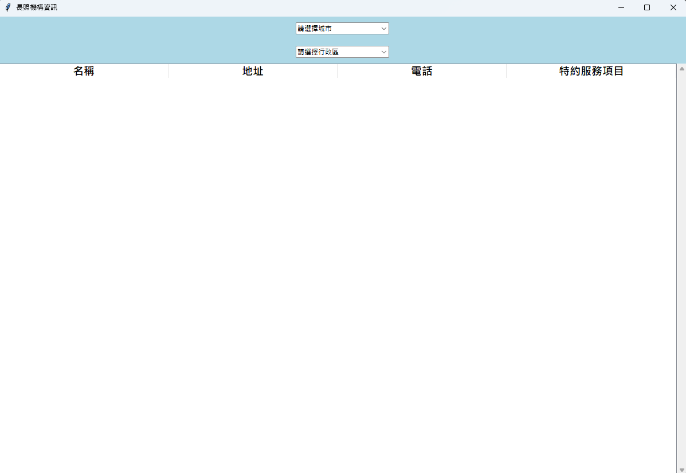
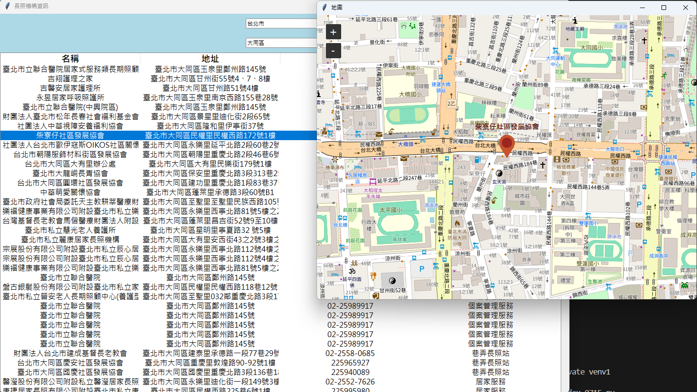

## TVDI_Project_LTC
### 長照(LTC, aka Long-Term Care)

* 小組成員：陳明勝、孫義翔、林重仰
* 專案主題：統整各地長照機構資訊，並用tkinter等展示相關資訊

### 範疇:
* 區域：台北市、新北市
* 資料來源：政府公開資訊
* 基本資料：長照機構總表
* 分工
  *  資料收集：陳明勝
  *  程式設計：林重仰
  *  圖表設計：孫義翔
 
## [示範影片](https://youtu.be/YSgZHcenBto)

## 程式執行後的首頁

## 選擇城市後，跑出的預設區域

## 在指定的列任意雙擊滑鼠，該長照機構的地點即顯示在地圖中

