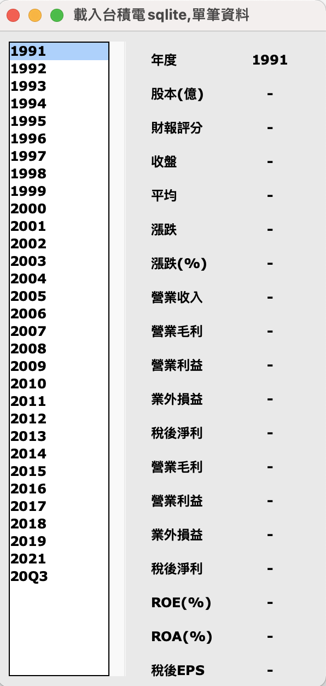

# 實際案例

1. [顯示表格資料使用CSV](./code/sample1_displayCSV_Grid.py)

---

2. [顯示表格資料使用sqlite](./code/sample2_displayTable_sqlite.py)

---

3.[建立ListBox+ScrollBar和Frame顯示單筆資料](./code/sample3_displayOneRow_listbox.py)

---

4. [建立ListBox+ScrollBar和Convas+ScrollBar,顯示單筆資料](./code/sample4_displayOneRow_listbox.py)
> 注意:必需先學習Convas的使用方法

---

5. [使用Treeview建立表格資料和TopLevel的操控](./code/sample5_displayTable_TreeView_topLevel.py)

---

6. [使用Treeview建立表格資料和自訂Dialog類別](./code/sample6_displayTable_TreeView_Dialog.py)

---

7-1. [顯示政府開放平台空氣品質指標簡易版](./code/sample8_顯示目前空氣品質.py)

7-2. [顯示政府開放平台空氣品質指標正式版](./code/sample9_空氣品質指標正式版.py)

7-3. [顯示政府開放平台空氣品質_分欄位的版本](./空氣品質指標aqi_csv_多欄位版/main.py)

9.[台北市youbike及時資料](./台北市youbike/index.py)

9-1. [台北市youbike及時資料簡易版(無計時)](./簡易版youbike/youbikeOfTaipei.py)

10. [股票及時查詢提醒系統(學員:梁晉嘉作品)](./股票及時查詢提醒系統/main.py)
