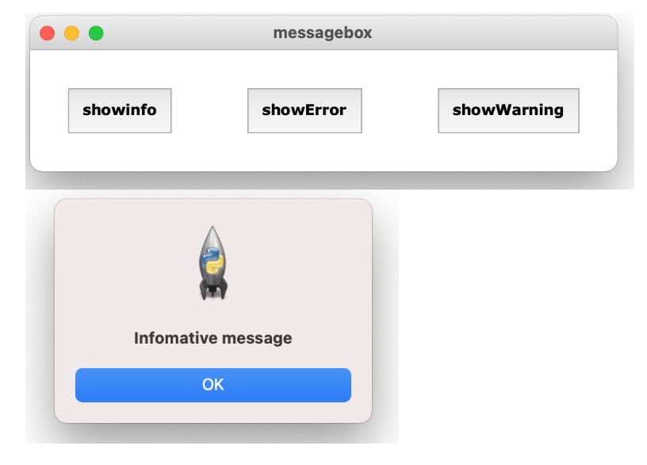
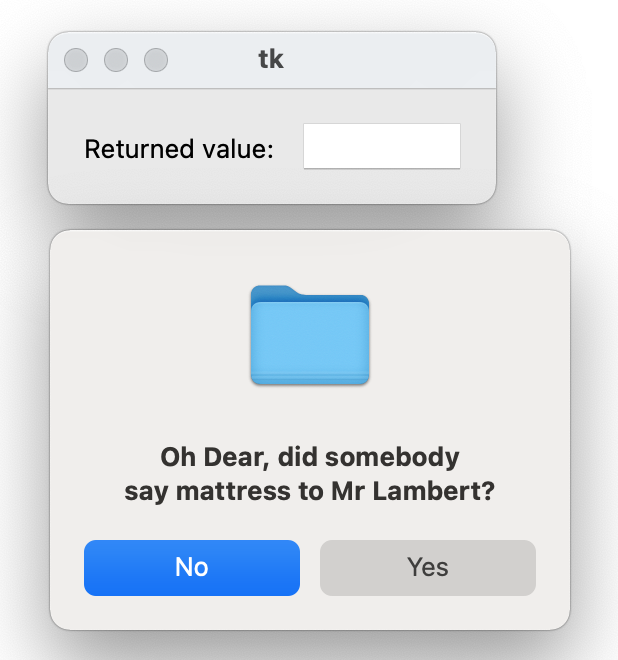
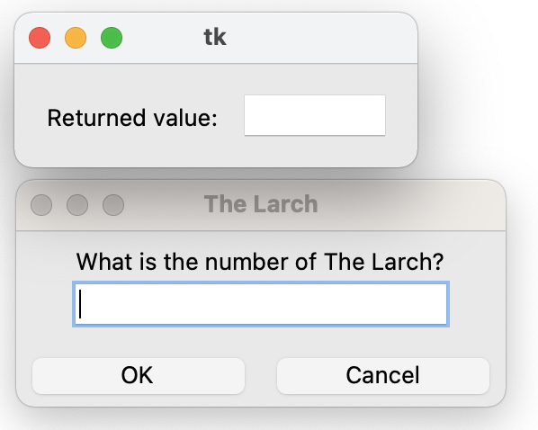
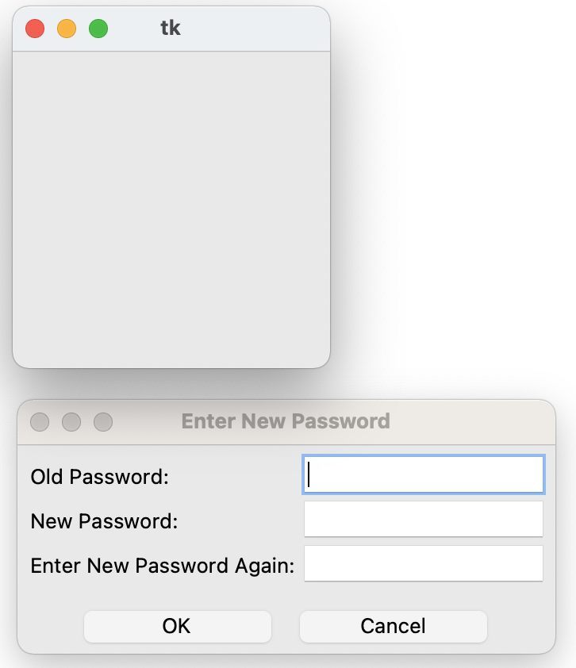
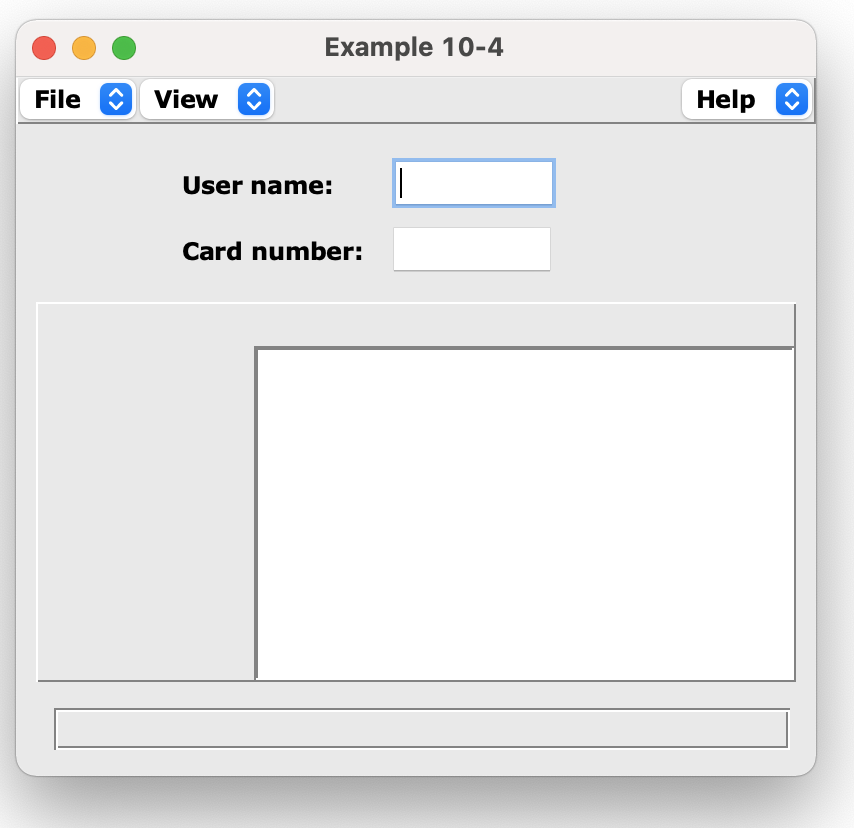

# 對話框和表單
對話框主要用於介面的提醒，警告，確認，錯誤提醒。而表單的功能主要定位於收集和顯示資訊，而在顯示資訊的同時，也可以讓使用者修改資訊。

也可以把對話框當作是最簡單的快單。

## 對話框

1. SimpleDialog
	- askstring
	- askinteger
	- askfloat

2. MessageBox
	- showinfo
	- showwarning
	- showerror
	- askyesno

3. 自訂對話框
	- [繼承simpledialog.Dialog](#自訂對話框(繼承Dialog))

### 標準對話框

使用MessageBox

```python
#lesson6_0_1_Message.py

from tkinter import messagebox
import tkinter as tk
from tkinter import *

class Window(tk.Tk):
    def __init__(self):
        super().__init__()
        self.option_add('*font',('verdana', 12, 'bold'))
        self.title("lesson2_1")

        Button(self, text='showinfo', padx=10,pady=10,command=lambda :messagebox.showinfo("information","Infomative message")).pack(side=LEFT,padx=30,pady=30)
        Button(self, text='showError', padx=10,pady=10,command=lambda : messagebox.showerror("Error","Error message")).pack(side=LEFT,padx=30,pady=30)
        Button(self, text='showWarning', padx=10,pady=10,command=lambda :messagebox.showwarning("Warning","Warning message")).pack(side=LEFT,padx=30,pady=30)

if __name__ == "__main__":
    window = Window()
    window.mainloop()

```



---


```python
from tkinter import *
from tkinter.messagebox import *
import Pmw

class App:
    def __init__(self, master):
        self.result = Pmw.EntryField(master, entry_width=8,
                                     value='',
                                     label_text='Returned value:  ',
                                     labelpos=W, labelmargin=1)
        self.result.pack(padx=15, pady=15)

root = Tk()
question = App(root)

button = askquestion("Question:",
                   "Oh Dear, did somebody\nsay mattress to Mr Lambert?",
                   default=NO)
question.result.setentry(button)

root.mainloop()
```




---

## Data Entry dialogs

```python
from tkinter import *
from tkinter.simpledialog import askinteger
import Pmw

class App:
    def __init__(self, master):
        self.result = Pmw.EntryField(master, entry_width=8,
                                     value='',
                                     label_text='Returned value:  ',
                                     labelpos=W, labelmargin=1)
        self.result.pack(padx=15, pady=15)

root = Tk()
display = App(root)

retVal = askinteger("The Larch",
                    "What is the number of The Larch?",
                    minvalue=0, maxvalue=50)
display.result.setentry(retVal)

root.mainloop()
```




---

```python
from tkinter import *
from tkinter.simpledialog import Dialog
from tkinter import messagebox


class GetPassword(Dialog):

    def body(self, master):
        self.title("Enter New Password")

        Label(master, text='Old Password:').grid(row=0, sticky=W)
        Label(master, text='New Password:').grid(row=1, sticky=W)
        Label(master, text='Enter New Password Again:').grid(row=2, sticky=W)

        self.oldpw = Entry(master, width=16, show='*')
        self.newpw1 = Entry(master, width=16, show='*')
        self.newpw2 = Entry(master, width=16, show='*')

        self.oldpw.grid(row=0, column=1, sticky=W)
        self.newpw1.grid(row=1, column=1, sticky=W)
        self.newpw2.grid(row=2, column=1, sticky=W)
        return self.oldpw

    def apply(self):
        opw = self.oldpw.get()
        npw1 = self.newpw1.get()
        npw2 = self.newpw2.get()

        if not npw1 == npw2:
            messagebox.showerror('Bad Password',
                                   'New Passwords do not match')
        else:
            # This is where we would set the new password...
            pass


root = Tk()
dialog = GetPassword(root)
```



```python
from tkinter import *
import Pmw
import string


class Shell:
    def __init__(self, title=''):
        self.root = Tk()
        self.root.option_add('*font', ('verdana', 12, 'bold'))
        Pmw.initialise(self.root)
        self.root.title(title)

    def doBaseForm(self, master):
        # Create the Balloon.
        self.balloon = Pmw.Balloon(master)

        self.menuBar = Pmw.MenuBar(master, hull_borderwidth=1,
                                   hull_relief='raised',
                                   hotkeys=1, balloon=self.balloon)
        self.menuBar.pack(fill='x')
        self.menuBar.addmenu('File', 'Exit')
        self.menuBar.addmenuitem('File', 'command',
                                 'Exit the application',
                                 label='Exit', command=self.exit)
        self.menuBar.addmenu('View', 'View user information')
        self.menuBar.addmenuitem('View', 'command',
                                 'Get user information',
                                 label='Get info',
                                 command=self.getStatus)
        self.menuBar.addmenu('Help', 'About Example 10-4', side='right')
        self.menuBar.addmenuitem('Help', 'command',
                                 'Get information on application',
                                 label='About...', command=self.help)

        self.dataFrame = Frame(master)
        self.dataFrame.pack(fill='both', expand=1)

        self.infoFrame = Frame(self.root,
                               bd=1, relief='groove')
        self.infoFrame.pack(fill='both', expand=1, padx=10)

        self.statusBar = Pmw.MessageBar(master, entry_width=40,
                                        entry_relief='groove',
                                        labelpos='w',
                                        label_text='')
        self.statusBar.pack(fill='x', padx=10, pady=10)

        # Add balloon text to statusBar
        self.balloon.configure(statuscommand=self.statusBar.helpmessage)

        # Create about dialog.
        Pmw.aboutversion('10.4')
        Pmw.aboutcopyright('Copyright My Company 1999\nAll rights reserved')
        Pmw.aboutcontact(
            'For information about this application contact:\n' +
            '  My Help Desk\n' +
            '  Phone: 800 555-1212\n' +
            '  email: help@my.company.com'
        )
        self.about = Pmw.AboutDialog(master,
                                     applicationname='Example 10-4')
        self.about.withdraw()

    def exit(self):
        import sys
        sys.exit(0)

    def getStatus(self):
        username = self.userName.get()
        cardnumber = self.cardNumber.get()
        self.img = PhotoImage(file='%s.gif' % username)
        self.pictureID['image'] = self.img
        self.userInfo.importfile('%s.txt' % username)
        self.userInfo.configure(label_text=username)

    def help(self):
        self.about.show()

    def doDataForm(self):
        self.userName = Pmw.EntryField(self.dataFrame, entry_width=8,
                                       value='',
                                       modifiedcommand=self.upd_username,
                                       label_text='User name:      ',
                                       labelpos=W, labelmargin=1)
        self.userName.place(relx=.20, rely=.325, anchor=W)

        self.cardNumber = Pmw.EntryField(self.dataFrame, entry_width=8,
                                         value='',
                                         modifiedcommand=self.upd_cardnumber,
                                         label_text='Card number:  ',
                                         labelpos=W, labelmargin=1)
        self.cardNumber.place(relx=.20, rely=.70, anchor=W)

    def doInfoForm(self):
        self.pictureID = Label(self.infoFrame, bd=0)
        self.pictureID.pack(side='left', expand=1)

        self.userInfo = Pmw.ScrolledText(self.infoFrame,
                                         borderframe=1,
                                         labelpos='n',
                                         usehullsize=1,
                                         hull_width=270,
                                         hull_height=100,
                                         text_padx=10,
                                         text_pady=10,
                                         text_wrap='none')

        self.userInfo.configure(text_font=('verdana', 8))
        self.userInfo.pack(fill='both', expand=1)

    def upd_username(self):
        upname = string.upper(self.userName.get())
        if upname:
            self.userName.setentry(upname)

    def upd_cardnumber(self):
        valid = self.cardNumber.get()
        if valid:
            self.cardNumber.setentry(valid)


if __name__ == '__main__':
    shell = Shell(title='Example 10-4')
    shell.root.geometry("%dx%d" % (400, 350))
    shell.doBaseForm(shell.root)
    shell.doDataForm()
    shell.doInfoForm()
    shell.root.mainloop()

```



---


```python
from tkinter import *


class Var(Frame):
    def __init__(self, master=None):
        Frame.__init__(self, master)
        self.pack()

        self.field = Entry()
        self.field.pack()

        self.value = StringVar()
        self.value.set("Jean-Paul Sartre")
        self.field["textvariable"] = self.value

        self.field.bind('<Key-Return>', self.print_value)

    def print_value(self, event):
        print('Value is "%s"' % self.value.get())


test = Var()
test.mainloop()
```

## 自訂對話框(繼承Dialog)

當然！以下是一個簡單的範例，說明如何繼承 `tkinter` 中的 `Dialog` 類來創建自定義對話框。這個範例展示了如何創建一個自定義對話框，要求用戶輸入姓名並返回輸入結果。

首先，確保你的 Python 環境中已經安裝了 `tkinter`。然後，你可以按照以下範例進行操作：

```python
import tkinter as tk
from tkinter import simpledialog

class MyCustomDialog(simpledialog.Dialog):
    def __init__(self, parent, title=None):
        super().__init__(parent, title)

    def body(self, master):
        # 創建對話框主體。返回應具有初始焦點的控件。
        tk.Label(master, text="請輸入你的名字:").grid(row=0)
        self.name_entry = tk.Entry(master)
        self.name_entry.grid(row=0, column=1)
        return self.name_entry

    def apply(self):
        # 當用戶按下確定時處理數據
        self.result = self.name_entry.get()

# 範例用法：
if __name__ == "__main__":
    root = tk.Tk()
    root.withdraw()  # 隱藏根窗口

    dialog = MyCustomDialog(root, title="自定義對話框")
    if dialog.result is not None:
        print("用戶的名字:", dialog.result)
    else:
        print("對話框已取消")
```

### 說明：
1. **繼承 `simpledialog.Dialog` 類:**
   - 我們創建了一個繼承自 `simpledialog.Dialog` 的自定義對話框類 `MyCustomDialog`。

2. **重寫 `body` 方法:**
   - `body` 方法用於創建對話框的主要部分。在這個範例中，創建了一個標籤和一個輸入控件。
   - `self.name_entry` 是一個類變量，用於存儲輸入控件，將用於捕獲用戶輸入。

3. **重寫 `apply` 方法:**
   - 當用戶按下確定按鈕時，會調用 `apply` 方法。在這裡，我們從輸入控件中獲取輸入並存儲在 `self.result` 中。

4. **範例用法:**
   - 我們創建了一個根窗口並立即將其隱藏。
   - 創建了一個 `MyCustomDialog` 的實例，顯示對話框。
   - 如果對話框沒有被取消，則打印結果（用戶的輸入）。

這個範例提供了一個基本的自定義對話框。你可以進一步自定義它，添加更多控件、驗證和其他邏輯。