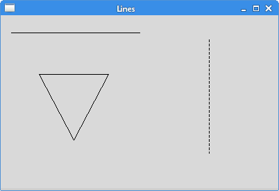
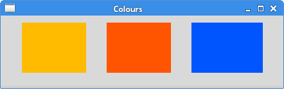
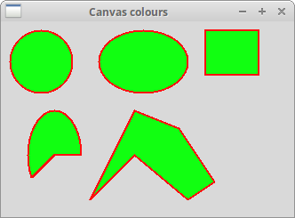
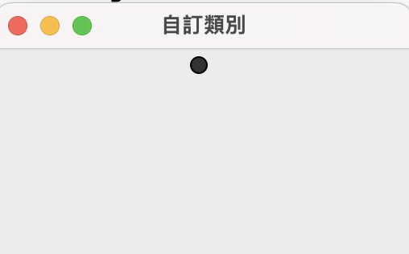

# Canvas

## 畫線

```python
from tkinter import Tk, Canvas, Frame, BOTH

class Example(Frame):

    def __init__(self,master):
        super().__init__(master)
        self.initUI()
        self.master.title("Lines")
        self.pack(fill=BOTH, expand=1)


    def initUI(self):
        canvas = Canvas(self)
        canvas.create_line(15, 30, 200, 30)
        canvas.create_line(300, 35, 300, 200, dash=(4, 2))
        canvas.create_line(55, 85, 155, 85, 105, 180, 55, 85)
        canvas.pack(fill=BOTH, expand=1)


def main():

    root = Tk()
    ex = Example(root)
    root.geometry("400x250+300+300")
    root.mainloop()


if __name__ == '__main__':
    main()
```



## 矩形(線框和填色)

```python
from tkinter import Tk, Canvas, Frame, BOTH


class Example(Frame):

    def __init__(self,master):
        super().__init__(master)
        self.master.title("Colours")
        self.pack(fill=BOTH, expand=1)
        self.initUI()


    def initUI(self):
        canvas = Canvas(self)
        canvas.create_rectangle(30, 10, 120, 80,
            outline="#fb0", fill="#fb0")
        canvas.create_rectangle(150, 10, 240, 80,
            outline="#f50", fill="#f50")
        canvas.create_rectangle(270, 10, 370, 80,
            outline="#05f", fill="#05f")
        canvas.pack(fill=BOTH, expand=1)
def main():

    root = Tk()
    ex = Example(root)
    root.geometry("400x100+300+300")
    root.mainloop()


if __name__ == '__main__':
    main()
```



## 不規則形狀,圓形,圓弧形

```python
from tkinter import Tk, Canvas, Frame, BOTH

class Example(Frame):

    def __init__(self,master):
        super().__init__()
        master.title("Shapes")
        self.pack(fill=BOTH, expand=1)
        self.initUI()


    def initUI(self):

        canvas = Canvas(self,width=400,height=400)
        canvas.create_oval(10, 10, 80, 80, outline="#f11",
            fill="#1f1", width=2)
        canvas.create_oval(110, 10, 210, 80, outline="#f11",
            fill="#1f1", width=2)
        canvas.create_rectangle(230, 10, 290, 60,
            outline="#f11", fill="#1f1", width=2)

        canvas.create_rectangle(30, 200, 90, 100,
                                outline="#f11", fill="#1f1", width=2)

        canvas.create_arc(30, 200, 90, 100, start=0,
            extent=180, outline="#f11", fill="#1f1", width=2)


        points = [150, 100, 200, 120, 240, 180, 210,
            200, 150, 150, 100, 200]
        canvas.create_polygon(points, outline='#f11',
            fill='#1f1', width=2)

        canvas.pack(fill=BOTH, expand=1)


def main():

    root = Tk()
    ex = Example(root)
    root.geometry("330x220+300+300")
    root.mainloop()


if __name__ == '__main__':
    main()
```



## 畫圖片

```python
from tkinter import Tk, Canvas, Frame, BOTH, NW
from PIL import Image, ImageTk

class Example(Frame):

    def __init__(self,master):
        super().__init__(master)
        master.title("Home icon")
        self.pack(fill=BOTH, expand=1)
        self.initUI()


    def initUI(self):

        self.img = Image.open("home.png")
        self.tatras = ImageTk.PhotoImage(self.img)
        canvas = Canvas(self, width=self.img.size[0]+20,
           height=self.img.size[1]+20)
        canvas.create_image(10, 10, anchor=NW, image=self.tatras)
        canvas.pack(fill=BOTH, expand=1)


def main():
    root = Tk()
    ex = Example(root)
    root.mainloop()


if __name__ == '__main__':
    main()

```


## 自訂Canvas類別

```python
from tkinter import Tk,Canvas

class RedBall(Canvas):
    def __init__(self,master,**kw):
        super().__init__(master=master,**kw)
        self.configure(width=20)
        self.configure(height=20)
        self.create_oval(5,5,15,15,fill='#333333')

class Window(Tk):
    def __init__(self):
        super().__init__()
        redball = RedBall(self)
        redball.pack()

if __name__ == "__main__":
    root = Window()
    root.title("自訂類別")
    root.mainloop()

```




